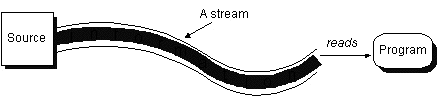
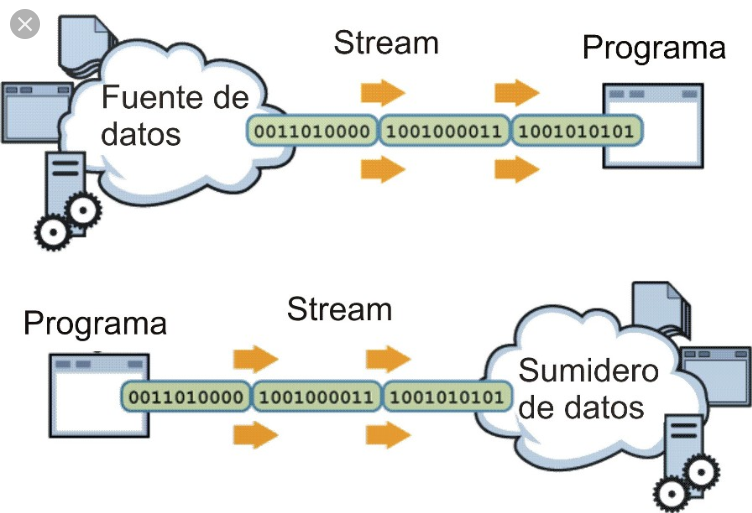
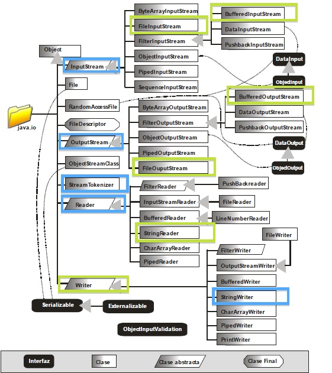
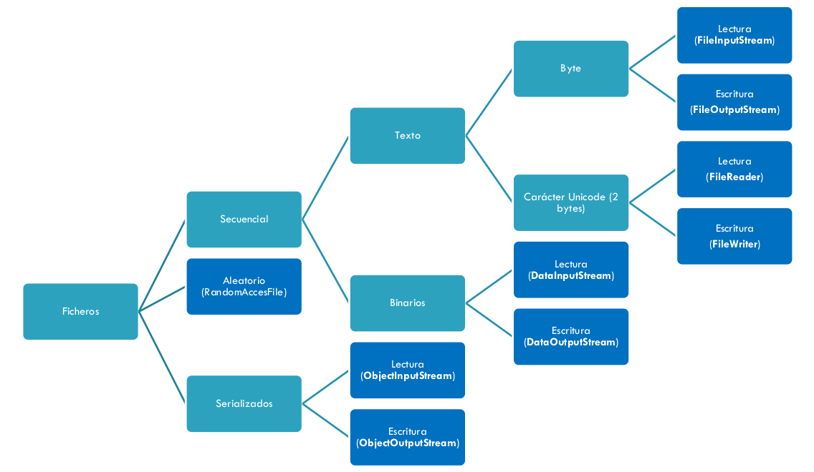
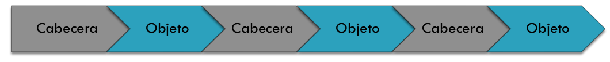

# 0. Introducción


## Ficheros

<div style="text-align: justify">

**Fichero**: conjunto de bits almacenado en un dispositivo

Tienen **nombre** y se ubican en directorios\. El nombre es único en un directorio\.

Tienen diferentes **extensiones**: indica el tipo de contenido y formato\.

Los que almacenan datos están formados por un conjunto de registros\, y cada registro por campos\.

La forma de agrupar los datos depende de la persona que lo diseñe\.

</div>


## Tipos de ficheros

* Modos de acceso:
  * Secuencial
  * Aleatorio
* Procesos sobre ficheros:
  * Consulta
  * Alta
  * Baja
  * Modificación


# 1. Tipos de ficheros según su contenido


<div style="text-align: justify">

* Ficheros de **texto**:
  * Contienen una secuencia de caracteres\. En ellos se almacena texto codificado en una codificación como UTF\-8\, ANSI\, etc\.
* Ficheros **binarios**:
  * Pueden contener cualquier tipo de información\. Son ficheros binarios los PDF, AVI, JPG\, etc\.

Realmente cualquier fichero de texto también puede considerarse que es binario pero no al revés
</div>

# 2. Codificaciones para ficheros de texto


<div style="text-align: justify">

Cuando se lee o se graba un fichero de texto es muy importante la **codificación** en que se realiza\.

La codificación especifica __cómo se debe representar__ internamente en binario cada carácter\.

Si se usan distintas codificaciones para leer y grabar un fichero\, puede ocurrir que al leerlo y mostrarlo se vean representados algunos caracteres que no se corresponden con los que se guardaron o escribieron\.

Actualmente se ha establecido como codificación estándar de ficheros de texto  UTF\-8\. 
Anteriormente se usaban las codificaciones ANSI y otras\.

</div>

# 3. La clase File para operaciones de gestión de ficheros


<div style="text-align: justify">

Clase **File** de Java: proporciona un conjunto de utilidades relacionadas con los ficheros que nos da información de los mismos y nos permite realizar acciones sobre ellos\.

Representa un fichero o un directorio\.

*NOTA: la ruta absoluta en **Linux** es "/" y en **Windows** es “C:\\\\”, aunque se puede usar C:/*

Ha pasado a segundo plano desde la ***Java NIO.2***

</div>


<div style="text-align: justify">

* __Constructores__ para File: \(Buscar en la API Java\)
  * File\(String directorioyFichero\)
  * File\(String directorio\, String fichero\)
  * File\(File directorio\, String fichero\)
* Métodos importantes:
  * getName\(\)\, getPath\(\)\, getAbsolutePath\(\)\, 
  canRead\(\)\, canWrite\(\)\, length\(\)\, createNewFile\(\)\, 
  delete\(\)\, exists\(\)\, getParent\(\)\, isDirectory\(\)\, 
  isFile\(\)\, mkdir\(\)\, renameTo\(\)\, list\(\)\, listFiles\(\)

</div>


## Ejemplo 1: Lista de ficheros del directorio actual

Crear un programa que escriba un listado del nombre de ficheros y subdirectorios que haya en el directorio actual de trabajo (“\.”). 

* Hay que instanciar un objeto File y obtener la lista de los nombres de sus elementos (ficheros y subdirectorios) con el método  **list()**

* Recorrer la estructura de datos en que se almacena esa lista para obtener los nombres de los elementos\.


## Ejemplo 1: Lista de ficheros del directorio actual v1

```java
import java.io.File;
public class VerDir1
{
    public static void main(String[] args)
    {
        File directorio = new File(".");
        System.out.println("Ficheros de directorio actual:" + directorio.getAbsolutePath());
        String[] archivos = directorio.list();
        for (int i = 0; i < archivos.length; i++)
        {
            System.out.println(archivos[i]);
        }
    }
}
```


## Ejemplo 1: Lista de ficheros del directorio actual v2

```java
import java.io.*;
public class VerDir2
{
    public static void main(String[] args)
    {
        File directorio = new File(".");
        System.out.println("Ficheros de directorio actual:" + directorio.getAbsolutePath());
        File[] listaFicheros = directorio.listFiles();
        for (File fichero: listaFicheros)
        {
            System.out.println(fichero.getName());
        }
    }
}
```

## Modificaciones al ejemplo

* Para mostrar los nombres de los ficheros de **/home/ivan/NetBeansProjects**. 
  
```java
public class Ejemplo1_1
{
    public static void main(String[] args)
    {
        File directorio = new File("/home/ivan/NetBeansProjects");
        if (directorio.exists())
        {
            System.out.println("Ficheros del directorio " + directorio.getAbsolutePath());
            // El método listFiles devuelve un array de objetos File. 
            // Uno por cada elemento del directorio
            File[] listaFicheros = directorio.listFiles();
            // Para cada elemento File del array listaFicheros
            for (File fichero: listaFicheros)
            {
                System.out.println(fichero.getName());
            }
        }
        else
        {
            System.err.println("ERROR. No existe el directorio " + 
                    directorio.getAbsolutePath());
        }
    }
}

```


* Para mostrar los ficheros del directorio cuya ruta absoluta sea introducida por teclado\. 


```java
public class Ejemplo1_2
{
    public static void main(String[] args)
    {
        Scanner teclado = new Scanner(System.in);
        String ruta = teclado.nextLine();
        File directorio = new File(ruta);
        if (directorio.exists())
        {
            System.out.println("Ficheros del directorio " + ruta);
            File[] listaFicheros = directorio.listFiles();
            for (File fichero: listaFicheros)
            {
                System.out.println(fichero.getName());
            }
        }
        else
        {
            System.err.println("ERROR. No existe el directorio " + ruta);
        }
    }
}
```

> Hoja01_Ficheros_01


# 4. Formas de acceso a un fichero


Aunque hay otras, las dos más utilizadas son:

  * Acceso **secuencial**
  * Acceso directo o **aleatorio**

En esta unidad trabajaremos sólo el acceso secuencial. Para acceder a un dato del fichero hay que leer todos los que hay antes de ese dato, desde el principio hasta encontrarlo.


## Operaciones básicas sobre ficheros

Operaciones básicas sobre ficheros (independientemente del acceso):

  * Creación
  * Apertura
  * Cierre
  * Lectura de los datos
  * Escritura de los datos


## Operaciones sobre ficheros secuenciales

Hay que tener en cuenta que sus registros se insertan en el orden en que se guardan,uno detrás del otro.

* __Consulta__: para ver un registro, se empieza desde el 1º y se lee secuencialmente hasta localizar el registro buscado.
* __Altas__: se añade un registro al final del fichero. Cuando un fichero está ordenado, un alta supone una inserción en medio del fichero y habría que usar un fichero auxiliar.


* __Bajas__: se leen todos los registros y se copian en un fichero auxiliar, excepto el que se quiere borrar. Una vez reescrito, se borra el fichero inicial y se renombra el auxiliar con el nombre del fichero original.
* __Modificaciones__: similar a las bajas, solo que el registro en cuestión se escribe en el auxiliar con los datos cambiados.


# 5. Flujos o streams


Un **stream** o flujo es un objeto que establece la conexión o vía de comunicación entre el programa y un dispositivo de entrada o de salida (teclado, pantalla, fichero, conexión de red).

Para leer, a través del flujo podemos extraer la información del dispositivo de entrada:




Los accesos a los flujos suelen ser todos parecidos:

  * Para hacer **lecturas**: abrir flujo\, leer mientras queden datos\, cerrar flujo\.
  * Para hacer **escrituras**: abrir flujo\, escribir en el flujo\, cerrar flujo\.











## 5.1 Tipos de flujos secuenciales

* Flujos de bytes (8 bits)
  * Operaciones E/S de **bytes**.
  * Clases:
    * **InputStream**
    * **OutputStream**
* Flujos de caracteres (16 bits)
  * Operaciones E/S de **caracteres**.
  * Clases: 
    * **Reader**
    * **Writer**


# 6. Flujos byte a byte


## 6.1 Lectura byte a byte

* La clase **InputStream** y sus hijas se utilizan para leer flujos de datos byte a byte.
* Definen las funciones básicas de lectura de una secuencia de bytes pura.
* Con la clase **FileInputStream** leemos de ficheros de forma secuencial. Para crear un objeto FileInputStream asociado a un fichero se utiliza el constructor:


```java
    FileInputStream (File f)
```


* Presenta el método **read()** para la lectura del fichero:
  * **int read()**:  devuelve el siguiente carácter del fichero ó -1 si no hay más.
  * **int read(byte a[])**: llena el array a con los caracteres leídos del fichero. Devuelve la longitud del vector que se ha llenado si se realizó con éxito o –1 si no hay más datos porque se alcanzó el final del archivo.
  * **int read(byte[] b, int off, int len)**:  lee *len* caracteres del fichero, insertándolos en el array a.
* El método **available()** devuelve cuántos bytes quedan por leer en el fichero.


## Ejemplo 2_1

Crea un programa para leer el contenido del fichero **imagen.jpg** situado en el escritorio y escribe el contenido interno (valor de cada uno de sus bytes) del fichero.

Recuerda que muchos de los métodos que operan con flujos, pueden lanzar la excepción **IOException**. Por ello, es necesario tratarla en la llamada a esos métodos mediante un bloque *try-catch* o propagando la excepción mediante *throws*.


```java
public class Ejemplo2_1
{
    public static void main(String[] args) throws IOException
    {
        int c;
        FileInputStream f = null;
        try
        {
            f = new FileInputStream("/home/ivan/Escritorio/imagen.jpg");
            while (f.available() > 0)
            {
                c = f.read();
                System.out.print(c);
            }
        }
        catch (FileNotFoundException e)
        {
            System.err.println("Fichero no encontrado");
        }
        catch (IOException e)
        {
            System.err.println(e.toString());
        }
        //Tanto se haya terminado por try o por catch, se hace finally
        finally
        {
            if(f!=null)
                f.close();
        }
    }
}

```


## 6.2 Escritura byte a byte

* La clase __OutputStream__ y sus hijas se utilizan para escribir en flujos de datos byte a byte\.
* Definen las funciones básicas de escritura de una secuencia de bytes pura.
* Con la clase __FileOutputStream__ escribimos en ficheros de forma secuencial\. Para crear un objeto __FileOutputStream__ asociado a un fichero __\,__ se utiliza el constructor:

```java
    FileOutputStream(File f)
```


* Presenta el método **write()** para la escritura en el fichero. Este método se puede invocar de varias formas:
* **int write(int c)**: escribe el byte en el fichero.
* **int write(byte a[])**: escribe el contenido del array en el fichero.
* **int write(byte a[], int off, int len)**: escribe len caracteres del vector a en el fichero, comenzando desde la posición off.


Si un fichero existe y escribimos sobre él, todo lo anterior se borra\.

Si queremos añadir al final\, el constructor se usa de la siguiente manera:

```java
    FileOutputStream fileout = FileOutputStream(fichero, true);
```


## Ejemplo 2_2

Realiza un programa que permite añadir a un fichero llamado **mifichero.txt** situado en el escritorio el texto introducido por teclado (hasta que se pulse ENTER). Si no existe el fichero, se crea. 

*Aunque sea un fichero de texto, puede tratarse perfectamente con flujos de byte*


```java
public class Ejemplo2_2
{
    public static void main(String[] args)
    {
        Scanner teclado = new Scanner(System.in);
        try
        {
            //Abrir el flujo para añadir al fichero. 
            //Se usa en el constructor un segundo parámetro a valor true
            FileOutputStream f = new FileOutputStream("/home/ivan/Escritorio/mifichero.txt", true);
            //Recoger texto a añadir
            System.out.println("Introduce el texto a añadir (ENTER finaliza)");
            String linea = teclado.nextLine();
            //Recorrer cada char de linea y  grabar un byte por cada char
            for (int i = 0; i < linea.length(); i++)
            {
                char letra = linea.charAt(i);
                //se graba un byte
                f.write(letra);
            }
            //Grabar un salto de línea
            f.write(10);
            f.close();
        }
        catch (IOException e)
        {
            System.err.println("Error de E/S");
        }
    }
}
```
----

> Hoja01_Ficheros_02


# 7. Flujos de caracteres

## 7.1 Lectura de caracteres

* Métodos de __FileReader__ para leer:
  * **int read()**: lee un carácter y lo devuelve
  * **int read(char[] buf)**: lee hasta buf.length caracteres de datos de una matriz de caracteres. Los caracteres leídos los almacena en buf. 
  * **int read(char[] buf, int desplazamiento, int n)**: lee hasta n caracteres de datos de la matriz buf comenzando por buf[desplazamiento].

Los dos últimos devuelven el número de caracteres leídos. Si devuelve -1 es que se ha llegado al final del fichero.


## Ejemplo 3_1

Realiza un programa que lea los caracteres del fichero de texto pom.xml y lo muestre por pantalla.

Lanzar la excepción IOException en vez de capturarla.


```java
public class Ejemplo3_1
{
    public static void main(String[] args) throws IOException
    {
        // declarar el fichero y construir el objeto FileReader
        File fichero = new File("pom.xml");
        FileReader lector = new FileReader(fichero); //crea el flujo de entrada
        int i;
        //se va leyendo cada caracter. Fin de fichero de ficheros 
        //de texto se controla cuando se lee -1
        // FileReader no dispone de un método available    
        while ((i = lector.read()) != -1)
        {
            System.out.print((char) i);
        }
        lector.close();
    }
}
```


* Suele ser habitual querer las líneas completas, bien porque nos interesa la línea completa, bien para
poder analizarla luego y extraer campos de ella.
* FileReader no contiene métodos que nos permitan leer líneas completas, pero sí **BufferedReader**.
* BufferedReader hereda de Reader y contiene el método **readLine()**
* Cuando readLine() devuelve null, se ha llegado a fin de fichero

Modifica el ejemplo anterior para utilizar esta clase:


```java
public class Ejemplo3_1_BufferedReader
{
    public static void main(String[] args) throws IOException
    {
        File fichero = new File("pom.xml");
        BufferedReader lector = new BufferedReader(new FileReader(fichero));
        //Es lo mismo que:
        //FileReader fr = new FileReader(fichero); 
        //BufferedReader lector = new BufferedReader(fr); 
        String linea;
        while ((linea = lector.readLine()) != null)
        {
            System.out.println(linea);
        }
        lector.close();
    }
}
```


## 7.2 Escritura de caracteres

* Métodos de FileWriter para escritura:
  * **void write (int c)**: escribe un carácter
  * **void write(char[] buf)**: escribe en el fichero el contenido del array de caracteres.
  * **void write(char[]buf, int desplaza, int n)**: escribe n caracteres del array buf comenzando por buf[desplaza]
  * **void write(String str)**: escribe en el fichero una cadena de caracteres.


## Ejemplo 3_2

Realiza un programa que escriba caracteres en un fichero de nombre FichTexto.txt (si no existe lo crea). 

Los caracteres se escriben de uno a uno y se obtienen de un String.


```java
public class Ejemplo3_2
{
    public static void main(String[] args) throws IOException
    {
        File fichero = new File("FichTexto.txt");
        FileWriter escritor = new FileWriter(fichero);
        String cadena = "Esto es una prueba con FileWriter\r\nSegunda Linea";
        char[] cad = cadena.toCharArray();
        for (int i = 0; i < cad.length; i++)
        {
            escritor.write(cad[i]);
        }
        //en este caso es indiferente utilizar write que append
        escritor.close();
    }
}
```


* Suele ser habitual hacer uso de la clase **BufferedWriter** con el método **write(String s)** que
nos permiten grabar Strings en un fichero.
* Esta clase hereda de la clase Writer.
* Otro método muy útil es **newLine()** que crea una nueva línea en el fichero.
* Si queremos añadir al final de un fichero ya existente, simplemente debemos poner un flag a **true** como segundo parámetro del constructor de FileWriter.

Realiza un programa que permita recoger varios Strings, hasta que se introduce uno vacío y los grabe en un fichero de texto.


```java
public class Ejemplo3_2BufferedWriter
{
    public static void main(String[] args)
    {
        String linea;
        Scanner teclado = new Scanner(System.in/*, "iso-8859-1"*/);
        try
        {
            BufferedWriter escritor
                    = new BufferedWriter(new FileWriter("/home/ivan/Escritorio/ficheroTexto.txt"));
            //Graba en código ANSI ISO Latin1
            //Si quisiéramos grabar el fichero en UTF-8, habría que instanciar BufferedWriter así:
//            BufferedWriter escritor = new BufferedWriter(new OutputStreamWriter(
//                        new FileOutputStream("/home/ivan/Escritorio/ficheroTexto.txt"), "utf-8"));
            System.out.println("Introduce contenido del fichero de texto (línea vacía para fin):");
            while (!(linea = teclado.nextLine()).isEmpty())
            {
                escritor.write(linea);
                escritor.newLine(); //graba salto de línea
            }
            escritor.close();
        }
        catch (FileNotFoundException fn)
        {
            System.err.println("No se encuentra el fichero");
        }
        catch (IOException io)
        {
            System.err.println("Error de E/S");
        }
    }
}
```


* Otra clase útil puede ser **PrintWriter** que deriva de Writer.
* Tiene los métodos **print(String)** y **println(String)** para escribir en un fichero.
* Ambos reciben un String y lo graban en un fichero o lo envían a un dispositivo de salida.

Modifica el programa del ejemplo de uso de BufferedWriter para que haga lo mismo usando PrintWriter.


```java
public class Ejemplo3_3
{
    public static void main(String[] args)
    {
        String linea;
        Scanner teclado = new Scanner(System.in/*, "iso-8859-1"*/);
        try
        {
            // Creamos PrintWriter para grabar
            PrintWriter escritor
                    = new PrintWriter(new FileWriter("/home/ivan/Escritorio/ficheroTexto.txt"));
            System.out.println("Introduce contenido del fichero de texto (línea vacía para fin): ");
            while ((linea = teclado.nextLine()).length() > 0)
            {
                escritor.println(linea);
            }
            escritor.close();
        }
        catch (FileNotFoundException fn)
        {
            System.out.println("No se encuentra el fichero");
        }
        catch (IOException io)
        {
            System.out.println("Error de E/S");
        }
    }
}
```


> Hoja01_Ficheros_03


# 8. Ficheros binarios


* Cuando queremos trabajar con datos de tipo primitivo, ficheros binarios (bolean, byte, int, double,...) para después recuperarlos como tal el paquete java.io proporciona las clases **DataOutputStream** y **DataInputStream** que derivan de la clase OutputStream y InputStream respectivamente.


* Abrir un objeto con DataInputStream

```java
File fichero =new File(“nombre.dat”);
FileInputStream fileIn = new FileInputStream(fichero);
DataInputStream dataIn = new DataInputStream(fileIn);
```

* Abrir un objeto con DataOutputStream

```java
File fichero =new File(“nombre.dat”);
FileOutputStream fileOut = new FileOutputStream(fichero);
DataOutputStream dataOut = new DataOutputStream(fileout);
```


| Métodos para DataInputStream 	| Métodos para DataOutputStream 	|
|------------------------------	|-------------------------------	|
| boolean readBoolean();       	| void writeBoolean(boolean v); 	|
| byte readByte();             	| void writeByte(int v);        	|
| int readUnsignedByte();      	| void writeBytes(String s);    	|
| int readUnsignedShort();     	| void writeShort(int v);       	|
| short readShort();           	| void writeChars(String s);    	|
| char readChar();             	| void writeChar(int v);        	|
| int readInt();               	| void writeInt(int v);         	|
| long readLong();             	| void writeLong(long v);       	|
| float readFoat();            	| void writeFloat(float v);     	|
| double readDouble();         	| void writeDouble(double);     	|
| String readUTF();            	| void writeUTF(String str);    	|


## Ejemplo 4_1

* Realiza un programa que inserte datos en un fichero datos.dat. 
* Los datos los toma de dos arrays. Uno tiene nombres y el otro edades. Se recorren los dos arrays y se escribe en el fichero el nombre y la edad.


```java
public class Ejemplo4_1
{
    public static void main(String[] args) throws IOException, FileNotFoundException
    {
        File fichero = new File("datos.dat");
        FileOutputStream fos = new FileOutputStream(fichero);
        DataOutputStream escritor = new DataOutputStream(fos);

        String[] nombres =  {"Pepe", "María", "Diego", "Lucía", "Juan", "Sofía"};
        int[] edades = {22, 44, 66, 30, 27, 21};
        
        for (int i = 0; i < nombres.length; i++)
        {
            escritor.writeUTF(nombres[i]);
            escritor.writeInt(edades[i]);
        }
        escritor.close();
        fos.close();
    }
}
```


## Ejemplo 4_2

* Realiza un programa que visualice los datos grabados anteriormente de las personas con edad comprendida entre 20 y 30 años.


```java
public class Ejemplo4_2
{
    public static void main(String[] args) throws IOException, FileNotFoundException
    {
        File fichero = new File("datos.dat");
        FileInputStream fis = new FileInputStream(fichero);
        DataInputStream lector = new DataInputStream(fis);
        String nombre;
        int edad;
        try
        {
            nombre = lector.readUTF();
            while(true)
            {
                edad = lector.readInt();
                if(edad>=20 && edad<=30)
                    System.out.printf("Nombre: %-7s | Edad: %d |%n", nombre, edad);
                nombre = lector.readUTF();
            }
        }
        catch (EOFException e)
        {
            //Cuando acabe de leer los datos, siempre entrará por aquí
        }
        finally
        {
            lector.close();
            fis.close();
        }
    }
}
```

> Hoja01_Ficheros_04


# 9. Serialización


* Para leer y escribir objetos serializables, se usan las clases **ObjectInputStream** y **ObjectOutputStream**.
* Para almacenar objetos en un fichero y poder leerlos, el objeto tiene que implementar la interfaz **Serializable**. Sus métodos son:

```java
//Para leer un objeto
void readObject(ObjectOutputStream stream) throws IOException, ClassNotFoundException
//Para escribir un objeto
void writeObject(ObjectOutputStream stream) throws IOException
```

## Ejemplo 5_1

* Desarrolla una clase Persona que implementa la interfaz Serializable. 
* Se usará en un programa para escribir y leer objetos en un fichero de objetos serializables. 
* Los datos de esas personas (nombres y edades están en dos arrays)


```java
public class Persona implements Serializable
{
    private String nombre;
    private int edad;

    public Persona(String nombre, int edad)
    {
        this.nombre = nombre;
        this.edad = edad;
    }

    public String getNombre()
    {
        return nombre;
    }

    public void setNombre(String nombre)
    {
        this.nombre = nombre;
    }

    public int getEdad()
    {
        return edad;
    }

    public void setEdad(int edad)
    {
        this.edad = edad;
    }

    @Override
    public String toString()
    {
        return "Persona{" + "nombre=" + nombre + ", edad=" + edad + '}';
    }

}
```


```java
public class Ejemplo5_1
{
    public static void main(String[] args) throws IOException, FileNotFoundException
    {
        int opcion;
        Scanner teclado = new Scanner(System.in);
        File fichero = new File("fichero_personas.dat");
        do
        {
            System.out.println("MENU DE OPCIONES");
            System.out.println("1.- Escribir fichero");
            System.out.println("2.- Leer fichero");
            System.out.println("0.- Salir");
            System.out.println("Introduce opcion: ");
            opcion = teclado.nextInt();
            switch (opcion)
            {
                case 1:
                    escribir(fichero);
                    break;
                case 2:
                    leer(fichero);
                    break;
            }
        }
        while (opcion != 0);
    }

    public static void escribir(File fichero) throws FileNotFoundException, IOException
    {
        Persona persona;
        ObjectOutputStream escritor = new ObjectOutputStream(new FileOutputStream(fichero));
        String nombres[] =
        {
            "Ana", "Luis Miguel", "Alicia", "Pedro", "Manuel", "Andrés", "Julio", "Antonio", "María"
        };
        int edades[] ={18, 19, 19, 21, 22, 18, 22, 20, 19};
        
        for (int i = 0; i < edades.length; i++)
        {
            persona = new Persona(nombres[i], edades[i]);
            escritor.writeObject(persona);
        }
        escritor.close();
    }

    public static void leer(File fichero)
    {
        Persona persona;
        ObjectInputStream lector = null;
        try
        {
            lector = new ObjectInputStream(new FileInputStream(fichero));
            while (true)
            {
                persona = (Persona) lector.readObject();
                System.out.println(persona.toString());
            }
        }
        catch (EOFException eo)
        {
        }
        catch (IOException ex)
        {
            System.err.println("Error de E/S");
        }
        catch (ClassNotFoundException ex)
        {
            System.err.println("Error al convertir la clase");
        }
        finally
        {
            if(lector!=null)
                try {
                    lector.close();
            }
            catch (IOException ex) {
                System.err.println("Error de E/S");
            }
        }
    }

}
```


* Al instanciar un objeto ObjectOutputStream, se escriben unos bytes de cabecera en el fichero, antes incluso de que escribamos nada. Como el ObjectInputStream lee correctamente estos bytes de cabecera, aparentemente no pasa nada y ni siquiera nos enteramos que existen:


* El problema se presenta si escribimos unos datos en el fichero y lo cerramos. Luego volvemos a abrirlo para añadir datos, creando un nuevo ObjectOutputStream. 
* Imaginemos que implementamos el siguiente método:

```java
    public static void escribirPersona(Persona persona, File fichero) throws FileNotFoundException, 
            IOException
    {
        ObjectOutputStream escritor = new ObjectOutputStream(new FileOutputStream(fichero, true));
        escritor.writeObject(persona);
        escritor.close();
    }
```


* Cada vez que se llama al método, escribe una nueva cabecera y a continuación el objeto. 
* Después de llamarlo varias veces, el fichero nos quedaría así:




* Al intentar leer, el ObjectInputStream lee la cabecera del principio y luego se pone a leer objetos. Cuando llegamos a la segunda cabecera que se añadió al abrir por segunda vez el fichero para añadirle datos, obtendremos un error.
* Se lanza **StreamCorruptedException** y no podremos leer más objetos.


* Una posible solución es hacernos nuestro propio ObjectOutputStream, heredando del original y redefiniendo el método writeStreamHeader() vacío, para que no haga nada.

```java
public class ObjectOutputStreamSinCabeceras extends ObjectOutputStream
{
    /* Constructor que recibe OutputStream */
    public ObjectOutputStreamSinCabeceras(OutputStream out) throws IOException
    {
        super(out);
    }

    /* Constructor sin parámetros */
    protected ObjectOutputStreamSinCabeceras() throws IOException, SecurityException
    {
        super();
    }

    /* Redefinición del método de escribir la cabecera para que no haga nada. */
    @Override
    protected void writeStreamHeader() throws IOException
    {
    }
}
```


* Crearíamos un objeto de este tipo en caso que el fichero ya exista. 

```java
    public static void escribirPersona(Persona persona, File fichero) throws FileNotFoundException, 
            IOException
    {
        ObjectOutputStream escritor = null;
        if(fichero.exists())
            escritor = new ObjectOutputStreamSinCabeceras(new FileOutputStream(fichero, true));
        else
            escritor = new ObjectOutputStream(new FileOutputStream(fichero, true));
        escritor.writeObject(persona);
        escritor.close();
    }
```

> Hoja01_Ficheros_05

# 10. Java NIO.2


## 10.1 Interface Path

* Introducida en Java SE 7
* Representa una ruta en el sistema de ficheros
* Contiene el nombre de fichero y la lista de directorios usada para construir la ruta
* Permite manejar diferentes sistemas de ficheros (Windows, Linux, Mac, …)
* En muchas operacions haremos uso de métodos estáticos de la clase **Paths** 


## 10.2 Operaciones con Path

* Crear un Path

```java
        Path p1 = Paths.get("AD", "apuntes.txt");
        Path p2 = FileSystems.getDefault().getPath("AD", "apuntes.txt");
        Path p3 = Paths.get(System.getProperty("user.home"), "Documentos", "AD", "apuntes.txt");

        System.out.println(p1.toAbsolutePath().toString());
        System.out.println(p2.toAbsolutePath().toString());
        System.out.println(p3.toAbsolutePath().toString());
```


* Obtener información de un Path

```java
        Path path = Paths.get(System.getProperty("user.home"), "Documentos", "AD", "apuntes.txt");
        
        System.out.printf("toString: %s\n", path.toString());
        System.out.printf("getFileName: %s\n", path.getFileName());
        System.out.printf("getName(0): %s\n", path.getName(0));
        System.out.printf("getNameCount: %d\n", path.getNameCount());
        System.out.printf("subpath(0,3): %s\n", path.subpath(0, 3));
        System.out.printf("getParent: %s\n", path.getParent());
        System.out.printf("getRoot: %s\n", path.getRoot());
```


* Unir dos Path

```java
        Path base = Paths.get(System.getProperty("user.home"), "Documentos", "AD");
        Path archivo = Paths.get("apuntes.txt");

        Path completa = base.resolve(archivo);

        System.out.println(completa.toString());
```


* Comparar dos Path y eliminar redundancias

```java
        Path path1 = Paths.get(System.getProperty("user.home"), "Documentos", "AD", "..", "..",
                "Documentos", "AD", "apuntes.txt");

        Path path2 = Paths.get(System.getProperty("user.home"), "Documentos", "AD", "apuntes.txt");

        if (path1.equals(path2))
            System.out.println("Son iguales");
        else
            System.out.println("No son iguales");

        if (path1.normalize().equals(path2))
        {
            System.out.println("Después de normalizar, deberían ser iguales");
        }
```


## 10.2 Clase Files

* La clase **Files** perteneciente al paquete *java.nio.file* tiene muchos métodos estáticos para hacer múltiples operaciones con ficheros y directorios.


* La clase Files tiene métodos para realizar:
  * Comprobaciones: exists, notExists, isSameFile, isRegularFile, isReadable, isWritable, isExecutable, ...

```java
    public static void main(String[] args)
    {
        Path ruta = Paths.get("ejemplo5.txt");

        if (Files.notExists(ruta))
        {
            System.out.println("La ruta no existe");
            try
            {
                Files.createFile(ruta);
            }
            catch (IOException e)
            {
                System.err.println("Error de E/S al crear el fichero");
            }
        }
        
        //Un fichero NO regular podría ser un enlace simbólico o un directorio
        if (Files.isRegularFile(ruta))
            System.out.println("El fichero " + ruta.toString() + " es regular");

        Path ruta2 = Paths.get("ejemplo5.txt");

        if (Files.isWritable(ruta2))
            System.out.println("Tenemos permisos para escribir");


        try
        {
            if (Files.isSameFile(ruta, ruta2))
                System.out.println("Son el mismo fichero");
        }
        catch (IOException e)
        {
            System.err.println("Error de E/S al comparar los dos ficheros");
        }
    }
```


* La clase Files tiene métodos para:
  * Borrar (delete, deleteIfExists)
  * Copiar (copy)
  * Mover (move)
  * Para crear ficheros: 
    * Regulares (createFile)
    * Temporales (createTempFile)


```java
    public static void main(String[] args) throws IOException
    {
        //Creamos una ruta para crear un fichero
        Path ruta = Paths.get("ejemplo6.txt");

        //Creamos un fichero, y abrimos el flujo de texto para escribir
        BufferedWriter bw = Files.newBufferedWriter(ruta);
        bw.write("Ejemplo Java NIO para acceso a datos");
        bw.close();

        //Copiamos el fichero
        Path copia = Paths.get("ejemplo6_copia.txt");
        Files.copy(ruta, copia, StandardCopyOption.REPLACE_EXISTING);

        //Lo movemos a otro directorio
        copia = Files.move(copia, Paths.get("/home/ivan", "copiado.txt"), 
                StandardCopyOption.REPLACE_EXISTING);

        //Lo eliminamos
        Files.deleteIfExists(copia);
        
    }
```


* La lectura y escritura con Java NIO es mucho más sencilla:
  * Métodos readAllLines, lines, readString (desde Java 11)
  * Buffered de caracteres
    * Leer (newBufferedReader)
    * Escribir (newBufferedWriter)
  * Flujos de bytes
    * Leer (newInputStream)
    * Escribir (newOutputStream)


```java
    public static void main(String[] args) throws IOException
    {
        Path ficheroOriginal = Paths.get("cien_anyos_soledad.txt");
        Path copiaFichero = Paths.get("cien_anyos_soledad_copia.txt");

        if (Files.exists(ficheroOriginal))
        {
            //¡No utilizar con ficheros muy grandes!            
            List<String> todasLineas = Files.readAllLines(ficheroOriginal);

            BufferedWriter bw = Files.newBufferedWriter(copiaFichero);

            for (String linea : todasLineas)
            {
                bw.write(linea);
                bw.newLine();
            }

            bw.close();
        }

        //Utilizando también el API Stream
        System.out.println("== Mostramos sólo las lineas que contengan la palabra Macondo==\n");
        Stream<String> lineas = Files.lines(copiaFichero);
        lineas.filter(l -> l.contains("Macondo")).forEach(System.out::println);
    }
```


* También tiene métodos para **trabajar con directorios**
  * Listar
    * Contenido de directorios (newDirectoryStream, list, find, walk)
  * Crear
    * Crear un directorio (createDirectory, createDirectories)
    * Temporal (createTempDirectory)

Muchos más métodos en la [clase Files](https://docs.oracle.com/javase/7/docs/api/java/nio/file/Files.html)


```java
public class Ejemplo8
{
    public static void main(String[] args) throws IOException
    {
        Path ruta = Paths.get("/home/ivan", "directorio");
        if (Files.notExists(ruta))
            Files.createDirectory(ruta);

        DirectoryStream<Path> directoryStream = Files.newDirectoryStream(Paths.get("/home/ivan"));

        //Sólo podremos iterar sobre él
        for (Path p : directoryStream)
            System.out.println(p.getFileName());

        System.out.println("\n");

        //List devuelve todas las rutas de un directorio dado. Sólo un nivel
        //Con un Stream podemos filtrar, ordenar, recorrer...
        Stream<Path> stream = Files.list(Paths.get(System.getProperty("user.home")));
        stream.map(p -> p.getFileName().toString())
                .filter(p -> !p.startsWith("."))
                .sorted()
                .forEach(System.out::println);

        System.out.println("\n");

        //Método walk que nos devuelve todas las rutas a partir de uno dado
        int profundidad = 2;
        Stream<Path> stream2 = Files.walk(Paths.get(System.getProperty("user.home")), profundidad);
        Map<String, Long> agrupadoPorExtension = stream2
                .filter(p -> !p.toString().startsWith(System.getProperty("user.home") + "/.")
                && Files.isRegularFile(p))
                .collect(Collectors.groupingBy(Ejemplo8::getExtension, Collectors.counting()));
        
        agrupadoPorExtension.entrySet().stream()
                .sorted(Map.Entry.comparingByValue(Comparator.reverseOrder()))
                .forEach((t) -> System.out.printf("%s -> %d ficheros%n", t.getKey(), t.getValue()));
        
        Files.delete(ruta);
    }

    public static String getExtension(Path p)
    {
        String fileName = p.getFileName().toString();

        int i = fileName.lastIndexOf('.');
        if (i >= 0)
            return fileName.substring(i);
        return "";
    }
}
```

> Hoja01_Ficheros_06

