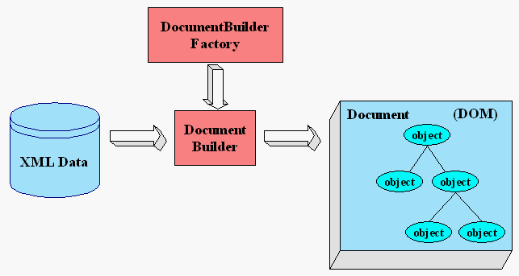
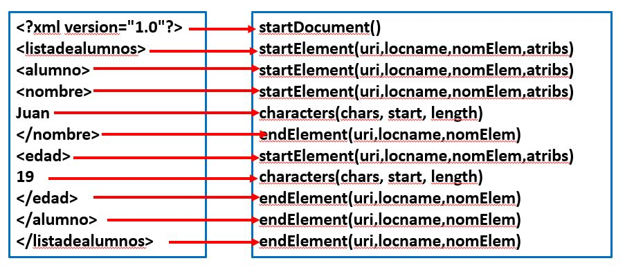
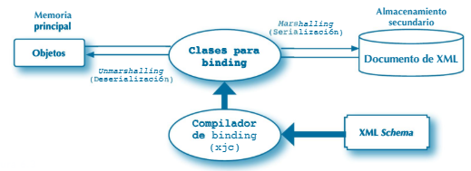

# 1. Parsers o analizadores sintácticos


## 1.1 Introducción

* Ya debes saber que:
  * **XML** es un lenguaje de marcas que permite representar información en un fichero de texto con una estructura jerárquica:

```xml
<?xml version="1.0"?>
<listadealumnos>
	<alumno>
		<nombre>Juan</nombre>
		<edad>19</edad>
	</alumno>
	<alumno>
		<nombre>Maria</nombre>
		<edad>20</edad>
	</alumno>
</listadealumnos>
```


 * La __validación__ de un documento XML es la comprobación de si un es correcto conforme a una especificación de estructura y contenido.
  * Un __esquema de XML__ es un documento que especifica la estructura y tipos de contenidos para un formato de documento XML\. 
  * Un __DTD__ es un documento que especifica la estructura pero no el tipo de contenidos\.
  * __XPath__  __y__  __Xquery__ son lenguajes de consulta de contenidos de ficheros XML\.


* Objetos de un documento XML:
  * Cabecera
  * Elemento
  * Texto
  * Atributo/valor


* Los elementos pueden anidarse\. Un elemento puede tener elementos hijos. Un elemento hijo tiene un elemento padre
* Puede haber elementos vacíos  \<Alumno/>
* Un documento XML también puede tener otros objetos:
  * Comentarios
  * Secciones CDATA
  * Espacios en blanco


## 1.2 Parsers

* Un **parser** o analizador sintáctico XML  es un software que verifica si un fichero XML es sintácticamente correcto y, en caso de serlo, obtiene datos con los contenidos del XML.


* En Java se usan varias tecnologías para realizar un __proceso de__  __parsing__ sobre un fichero de texto XML\. Las más conocidas son:
  * __DOM:__ todo el contenido del fichero queda en una estructura de tipo árbol \(en un objeto __Document__  __\)__
  * __SASX:__ va leyendo cada objeto del XML y por cada objeto dispara un evento que podemos programar\, por ejemplo\, evento de leído inicio de elemento\.
  * __JAXB:__ permite mapear un documento XML serializando a objetos


# 2. DOM con Java


* **DOM (Document Object Model)** es una tecnología para analizar ficheros de texto XML y _para modificarlos_.
* DOM trabaja con una estructura interna de _árbol_ que almacena el contenido de un fichero XML\.




* Para trabajar con __DOM__ en Java\, necesitamos las clases e interfaces del paquete __org\.w3c\.dom,__ así como las del paquete __javax\.xml\.parsers__.
* Para transformar una fuente de datos en fichero XML o\, al revés\, un fichero XML en unos datos resultado\, se usan las clases e interfaces de __java\.xml\.transform__


* En __javax\.xml\.parsers__ las clases más importantes son:
  * **DocumentBuilderFactory**: permite construir un **parser**.
  * **DocumentBuilder**: es el **parser**.
  * **ParserConfigurationException**: para manejar la excepción de fallo en la configuración del parser.
* [Documentación oficial sobre uso de DOM](https://docs.oracle.com/javase/tutorial/jaxp/dom/index.html)


## 2.1 Creación de un documento XML con DOM

* A continuación veremos un ejemplo de programa Java para crear un fichero XML desde cero con DOM:
  * Instanciaremos un parser
  * Construiremos con el parser un Document XML vacío
  * Añadiremos nodos de diferentes tipos al Document
  * Una vez que tengamos el Document XML con todos los nodos deseados, transformaremos el Document en un fichero XML.


**Paso 1. Construcción de un parser**

```java
// Crear una instancia de DocumentBuilderFactory que permitirá construir parsers
 DocumentBuilderFactory dBFactory = DocumentBuilderFactory.newInstance();
 
// Dentro de un try catch, construir el parser 
try {
  DocumentBuilder builder = dBFactory.newDocumentBuilder();
}
catch (ParserConfigurationException e){}
```


**Paso 2. Construcción de un Document vacío**

```java
// Crear un documento vacío
// La clase Document pertenece al paquete org.w3c.dom
Document doc = builder.newDocument();

// Asignamos cual va a ser la version de nuestro XML
doc.setXmlVersion("1.0");
```

* Se ha creado una estructura __árbol__ de datos __Document__ que alojará todo el contenido


Otros métodos de la clase **DocumentBuilderFactory**:

* Object __getAttribute__ \(String nombre\)
* void __setAttribute__ \(String nombre\,Objectvalor\)
* void **setValidating**(boolean esValidable)
* void __setIgnoringComments__(boolean ignorar)
* void **setIgnoringElementContentWhitespace**(boolean ignorar)
* Schema **getSchema**()
* boolean **isValidating**()


* Métodos para realizar un parsing de un fichero XML (de la clase **DocumentBuilder**):
  * Document **parse**(File fichero)
  * Document **parse**(InputStream flujo)
  * Document **parse**(String uri)


**Paso 3. Construcción del nodo raíz del Document**

```java
//Crear el elemento dentro del Document doc
Element elementAlumnos=doc.createElement("alumnos");

//Añadir el elemento al documento (se convierte en raíz)
//El elemento queda unido a la raíz de doc
doc.appendChild(elementAlumnos);
```

* Los elementos del **Document** se gestionan con objetos de la clase **Element**. El método **appenChild** permite añadir un Node a otro Node. En este caso se añade un Node de tipo Element a un Node de tipo Document.


**Paso 4. Establecer atributos del elemento alumnos**

```java
//Se pueden establecer valores de atributos de un elemento
//Por ejemplo, para que el elemento alumnos creado en paso 3 
//tenga atributo grupo con valor DAM2 y atributo aula con valor IF03
            
//Poner un atributo grupo de valor DAM2 al elemento alumnos
elementAlumnos.setAttribute("grupo", "DAM2");

//Añadir el elemento al documento (se convierte en raíz)
doc.appendChild(elementAlumnos);

//Poner un atributo aula de valor IF03 al elemento alumnos
//Se pueden asignar atributos en cualquier momento
elementAlumnos.setAttribute("aula", "IF03");
```


**Paso 5. Añadir un Elemento alumno dentro de alumnos**

```java
//Creamos un nuevo elemento alumno en el documento
//El elemento no está enganchado en el árbol
 Element elementAlumno = doc.createElement("alumno");
            
//Añadir el elemento alumno dentro del elemento alumnos
//En este momento alumno queda enganchado en el árbol a alumnos
 elementAlumnos.appendChild(elementAlumno);
 ```

 ---

**Paso 6. Añadir elementos nombre y edad con valores dentro del elemento alumno**

```java
// Añadir elementos para los datos de un alumno dentro del elemento alumno
            
//Creamos un nodo para el nombre (siempre se crean en el documento)
Element elementNombre=doc.createElement("nombre");
//Le asignamos un nodo de tipo TextNode creado en el doc
elementNombre.appendChild(doc.createTextNode("Ana Alonso"));
// Y lo añadimos al nodo alumno
elementAlumno.appendChild(elementNombre);

// Añadimos otro nodo con valor para la edad del alumno
 Element elementEdad=doc.createElement("edad");
Text textEdad=doc.createTextNode("20");
elementEdad.appendChild(textEdad);
elementAlumno.appendChild(elementEdad);
```


**Paso 7 y siguientes. Añadir resto de nodos**

* De igual forma que en los pasos 5 y 6 se podrían seguir añadiendo y estableciendo:
  * Nodos para más alumnos con la misma estructura
  * Nodos para más alumnos con distinta estructura
  * Nodos con cualquier nivel de anidamiento
  * Atributos para los nodos


**Paso Final. Transformación**

```java
//Ahora tenemos creado el documento (en memoria)
//Vamos a crear el fuente XML a partir del document
Source source=new DOMSource(doc);
//A partir del fuente se construye un objeto para almacenar el  
//resultado en el archivo alumnos.xml
Result result = new StreamResult(Files.newBufferedWriter(Paths.get("alumnos.xml")));
// Ahora hay que crear un objeto TransformerFactory para hacer 
//la transformación y convertir el documento en fichero
Transformer transformer = TransformerFactory.newInstance().newTransformer();
transformer.setOutputProperty(OutputKeys.INDENT,"yes");
transformer.transform(source, result);
```


**Comprobación de que el fichero se ha creado correctamente**

```java
Files.readAllLines(Paths.get("alumnos.xml"))
        .stream()
        .forEach(System.out::println);
```


## 2.2 Lectura y modificación de XML con DOM

* La lectura se basa en algoritmos de lectura de estructuras de árbol, navegando por nodos (objetos **Node**). Un nodo puede contener otros nodos.
* De un nodo se puede obtener su lista de nodos mediante un objeto **NodeList** y recorrer esa lista para acceder a cada uno de esos nodos.


* Por ejemplo en:

```xml
<departamento telefono="990033" tipo="A">
  <codigo>MAT1</codigo>
  <nombre>Matematicas</nombre>
</departamento>
```

* El nodo departamento contiene **4 nodos** de los cuales 2 son nodos de tipos **atributo** y otros 2 son nodos de tipo **elemento**


**La interface NodeList y sus métodos**

* La interface NodeList va a ser necesaria para recorrer los nodos del Document. Los métodos **getChildNodes** y **getElementsByTagName** devuelven en un NodeList los nodos hijos y los elementos con una etiqueta respectivamente que hay bajo un nodo.
* Los métodos más importantes de NodeList son:

```java
int getLength()
//Devuelve el número de nodos de la lista.

Node item(int index)
//Devuelve el nodo de la lista que ocupa la posición index
```


**La interface Node y sus métodos**
  
* Cada objeto de un document XML es un nodo y se maneja con un objeto **Node** o con un objeto específico para el tipo de objeto (Element, Text, Attr, etc.)


*Métodos para navegar entre nodos:*

```java
Node getFirstChild()
//Devuelve el primer nodo hijo de este nodo. Si no lo hay, devuelve null.

Node getNextSibling()
//Devuelve el nodo inmediatamente siguiente (hermano) a este nodo. Si no lo hay, devuelve null.

Node getParentNode()
//Devuelve el padre del nodo. Los de tipo Attr (atributo) y Document no tienen padre.

NodeList getChildNodes()
//Devuelve una lista de la clase NodeList que contiene todos los nodos hijo del nodo. 
//No se incluyen los de tipo Attr. Si no hay nodos hijo, la lista estará vacía.
```

*Métodos para añadir, eliminar y reemplazar nodos*

```java
Node appendChild(Node nodoNuevo)
//Añade el nodo nodoNuevo al final de la lista de hijos del nodo. Si el nodoNuevo ya está 
//en el árbol, no lo añade ni modifica. No nos referimos a que haya otro con el mismo nombre 
//sino a que el objeto nodo ya esté colgado en el árbol. Devuelve el nodo que se ha añadido.

Node insertBefore(Node nodoNuevo, Node nodoReferencia)
//Inserta el nodo nodoNuevo antes del nodo nodoReferencia que ya existe. Si el nodo 
//nodoReferencia es null, se inserta el nodo nodoNuevo al final de la lista de nodos hijo. 
//Devuelve el nodo que se ha insertado.

Node removeChild(Node nodo)
//Elimina, de la lista de hijos, el hijo indicado por parámetro como nodo y lo devuelve.

Node replaceChild(Node nodoNuevo, Node nodo)
//Sustituye el nodo nodo que se encuentre en la lista de nodos hijo por el nodo nodoNuevo.
```


*Métodos para manipular información de un nodo*

```java
short getNodeType()
//Devuelve un código identificativo del tipo de nodo que se trata. Para trabajar cómodamente 
//con esos códigos, la clase Node proporciona una serie de constantes para identificar los 
//tipos de nodos, como Node.ELEMENT_NODE para representar un nodo de tipo elemento.

String getNodeName()
//Devuelve el nombre del nodo dependiendo de su tipo (Attr, Element, ...).

String getNodeValue()
//Devuelve el valor del nodo dependiendo de su tipo (Attr, Comment, Text).

String getTextContent()
//Devuelve el texto del nodo y de sus descendientes.

void setNodeValue(String valorNodo)
//Establece el valor del nodo.

/* De la interface Element */
Attr setAttribute(String name, String value)
//Añade un nuevo atributo. Si el elemento ya lo contiene, lo reemplaza

void removeAtribute(String name)
//Borra el atributo pasado del nodo.
```


**Ejemplo de lectura**

En el ejemplo, accederemos a todos los nodos. 
***NO HAY PORQUÉ ACCEDER SIEMPRE A TODOS LOS NODOS***.

```xml
<?xml version="1.0" encoding="UTF-8" standalone="no"?>
<alumnos aula="IF03" grupo="DAM2">
  <alumno>
    <nombre>Ana Alonso</nombre>
    <edad>20</edad>
    <modulos>
      <modulo>
        <nombre>Acceso a Datos</nombre>
        <calificacion>6</calificacion>
      </modulo>
      <modulo>
        <nombre>PSP</nombre>
        <calificacion>7</calificacion>
      </modulo>
    </modulos>
  </alumno>
  <alumno>
    <nombre>Beatriz Blanco</nombre>
    <edad>21</edad>
    <modulos>
      <modulo>
        <nombre>Acceso a Datos</nombre>
        <calificacion>7.5</calificacion>
      </modulo>
    </modulos>
  </alumno>
</alumnos> 
```

**Paso 1: Construir el parser y cargar el documento**

```java
// Crear una instancia de DocumentBuilderFactory para construir el parser
 DocumentBuilderFactory factory = DocumentBuilderFactory.newInstance();
 
// Dentro de un try catch, construir el parser 
try {
  //Indicar que el modelo DOM no lea los comentarios que tenga el XML.  
  factory.setIgnoringComments(true);
  //Ignorar los espacios en blanco. Si no se hace esto entonces 
  //los espacios en blanco aparecen como nodos de texto.
  factory.setIgnoringElementContentWhitespace(true);
  //Crear objeto DocumentBuilder para parsear el XML y generar un Document.
  DocumentBuilder builder=factory.newDocumentBuilder();
  //cargar el contenido del fichero alumnos.xml en un Document
  Document doc=builder.parse("alumnos.xml");
// . . . . . . . . . . . .
}
catch (ParserConfigurationException e){}
catch (SAXException e){}
catch (IOException e){}
```


**Paso 2: Acceder al nodo raíz del Document doc, pintar su nombre y obtener una lista de todos sus nodos hijos que tengan etiqueta alumno**


```java
// a partir del doc, se obtiene el Element raíz 
Element raiz=doc.getDocumentElement();
                        
// Pinta el nombre del nodo raíz
System.out.println("Raiz del XML="+raiz.getNodeName());
            
//Crea una lista con todos los nodos de alumno que hay dentro del nodo alumnos
//Realmente en NodeList sólo habrá Elements
NodeList listaAlumnos=raiz.getElementsByTagName("alumno"); 
```


**Paso 3: Suponiendo que tenemos en listaAlumnos una lista de todos los nodos alumno, navegar por cada uno de los nodos alumno y pintar el nombre o etiqueta del nodo**

```java
for(int i=0; i<listaAlumnos.getLength();i++){
  //Carga en el nodo nodoAlumno el nodo i de la lista de nodos
  Node nodoAlumno=listaAlumnos.item(i);
  //Convertir Node en Element. No es necesario para obtener el nombre de un nodo. 
  //Pero recomendable para navegar hacia abajo
  Element element=(Element)nodoAlumno;
  //Pinta la etiqueta de element
  System.out.println(element.getTagName());
  //Podría haberse hecho con
  //System.out.println(nodoAlumno.getNodeName());
}
```


**Paso 4: Suponiendo que tenemos en element un objeto Element de un alumno, obtener el valor del contenido de los nodos nombre y edad de ese Element del alumno**

```java
//dentro del Element alumno, de una lista de elementos cuya etiqueta es nombre, 
//se extrae su elemento 0 (el único) y de él se saca el contenido texto
String textAlumno =element.getElementsByTagName("nombre").item(0).getTextContent();
//Dentro del nodo alumno, de una lista de elementos cuya etiqueta es edad, 
//se extrae su elemento 0 (el único) y de él se saca el texto con el valor
textAlumno=textAlumno+ ", " +element.getElementsByTagName("edad").item(0).getTextContent();

System.out.println(textAlumno);
```


**Paso 5: Suponiendo que tenemos en element un objeto Element de un alumno, obtener una lista de todos los nodos de tipo elemento con etiqueta modulo que tiene el alumno. Los elementos modulo están bajo un elemento modulos para cada alumno**

```java
//Del element del alumno obtenemos una lista de los nodos con etiqueta modulos que tiene
NodeList modulos=element.getElementsByTagName("modulos");
//Como sabemos que para cada element hay solo un elemento modulos
//Obtenemos ese elemento (el elemento 0 de la lista)
element=(Element)(modulos.item(0));

//A partir del elemento de la etiqueta modulos
//Obtenemos una lista de los elementos de etiqueta modulo que hay dentro 
NodeList listaModulos=element.getElementsByTagName("modulo");
```


**Paso 6: Suponiendo que tenemos en listaModulos una lista de todos los elementos modulo (de cada alumno), obtener nombre y calificación de cada módulo**

```java
//Recorremos listaModulos para obtener los nombres de los módulos
for(int j=0;j<listaModulos.getLength();j++){
    element=(Element)listaModulos.item(j);

    //pintamos el valor del nombre del módulo
     System.out.print("\t\t"+ element.getElementsByTagName("nombre").item(0).getTextContent());

    //pintamos el valor de la calificación
    System.out.println("\tcalificación="+ element.getElementsByTagName("calificacion")
        .item(0).getTextContent());
}
```


* En el siguiente ejemplo se hace una sustitución del contenido texto de un Element:

```java
// Obtener un elemento de etiqueta Nombre que hay bajo element
Element e = (Element)element.getElementsByTagName("nombre").item(0);

//Obtener el nodo de tipo Text que hay en el elemento Nombre
Text texto=(Text)e.getChildNodes().item(0);

//Obtener el texto de ese nodo Text y añadirle el texto “ Alonso”
String text=texto.getWholeText()+" Alonso";

//Eliminar el nodo texto del nodo e
e.removeChild(texto);

//Crear en el documento un nodo de tipo Text y añadirlo como hijo de e
Text nuevoTexto=doc.createTextNode(text);
e.appendChild(nuevoTexto);
```


* En el proyecto [**Ejemplo02_XML**](https://github.com/ivanlorenzorubio/ad2021-2022_apuntes/blob/main/ejemplos/Ejemplo02_XML) hay un proyecto con un ejemplo lectura y modificación de un fichero XML que contiene datos de alumnos. De cada alumno se tiene su nombre y edad.


* Se tiene una clase con varios métodos para el manejo de XML que podrás reutilizar:
  * Método para abrir un XML cargándolo en un Document.
  * Método para obtener los atributos de un nodo.
  * Método para recorrer los nodos hijos de un nodo Element.
  * Método para obtener los valores de los nodos Element de un Element alumno.
  * Método para añadir un nodo Element alumno dentro del  nodo raíz del Document.
  * Método para serializar el contenido de un Document en un fichero XML.


**Actividad sobre el ejemplo anterior**

* Utiliza el código anterior para hacer un programa que permita modificar los valores de un alumno:
  * Al método se le pasa un nombre de alumno y, si existe ese nombre, lo debe cambiar por un nuevo nombre que también se le pasa como parámetro.
  * El resultado debe ser guardado en un nuevo documento XML llamado “modificación.xml”


* El método modificarNombreAlumno podría ser así:

```java
    public void modificarNombreAlumno(String nombreAlumno, String nuevoNombreAlumno)
    {
        Node raiz = documento.getFirstChild();

        NodeList nodelist = raiz.getChildNodes();
        for (int i = 0; i < nodelist.getLength(); i++)
        {
            Node node = nodelist.item(i); //Nodo alumno
            if (node.getNodeType() == Node.ELEMENT_NODE)
            {
                Element elementoAlumno = (Element) node; //Elemento alumno
                Element elementoNombre = 
                        (Element) elementoAlumno.getElementsByTagName("nombre").item(0);
                //Obtenemos el valor del elemento
                String textoElementoNombre = elementoNombre.getTextContent();
                //Si el valor de ese elemento es igual a nombreAlumno
                if (textoElementoNombre.equalsIgnoreCase(nombreAlumno))
                {
                    //sustituimos el nodo Text que hay dentro del Element nombre por un nodo Text 
                    Text textoActual = (Text) elementoNombre.getChildNodes().item(0);
                    Text nuevoTexto = documento.createTextNode(nuevoNombreAlumno);
                    System.out.println("Se ha sustutuido " + textoActual.getWholeText() + " en " 
                            + elementoNombre.getNodeName());
                    elementoNombre.replaceChild(nuevoTexto, textoActual);
                }
            }
        }
    }
```


## 2.3 Serialización de documentos DOM

* La clase **Transformer** permite serializar documentos DOM, es decir, crear ficheros XML a partir de ellos.
* La serialización se realiza mediante el método:

```java
transform(Source xmlSource, Result outResult);
```
* Se pueden controlar las opciones de serialización mediante el método ***setOutputProperty***.


* El siguiente código, es uno de los posibles, para serializar un Document doc en un String mediante la clase StringWriter. Establece la codificación UTF-8 para la serialización e indents de 4 espacios para los distintos niveles de elementos

```java
Source domSource=new DOMSource(doc);
Transformer transformer = TransformerFactory.newInstance().newTransformer();
transformer.setOutputProperty(OutputKeys.METHOD,"xml");
transformer.setOutputProperty(OutputKeys.ENCODING,"UTF-8");
transformer.setOutputProperty(OutputKeys.INDENT,"yes");
transformer.setOutputProperty("{http://xml.apache.org/xslt}indent-amount", "4");
StringWriter sw=new StringWriter();
StreamResult sr=new StreamResult(sw);
transformer.transform(domSource, sr);
System.out.println(sw.toString());
```


* Otra opción posible para realizar lo anterior, es usar un Result construido a partir de un BufferedWriter:

```java
Source domSource=new DOMSource(doc);
Transformer transformer = TransformerFactory.newInstance().newTransformer();
transformer.setOutputProperty(OutputKeys.METHOD,"xml");
transformer.setOutputProperty(OutputKeys.ENCODING,"UTF-8");
transformer.setOutputProperty(OutputKeys.INDENT,"yes");
transformer.setOutputProperty("{http://xml.apache.org/xslt}indent-amount", "4");

Result result = new StreamResult(Files.newBufferedWriter(Paths.get("alumnos.xml")));
transformer.transform(domSource, result);
```

> Hoja02_XML_01

# 3. Análisis de XML con SAX


## 3.1 Cómo funciona SAX

* SAX permite analizar el contenido del documento según se va leyendo.
* La lectura del documento va generando eventos.
* SAX dispone de una serie de métodos con los que se puede programar la respuesta a los eventos.
* Para programar esos métodos hay que desarrollar una clase **Handler** o manejadora de eventos.


_Fichero XML y eventos que se producirían en su lectura SAX_




* Para programar la respuesta a los eventos de lectura XML tenemos que desarrollar una clase que hereda de una clase abstracta **Handler**. SAX dispone de las siguientes clases abstractas Handler:
  * **DefaultHandler**: la usaremos para interpretar XML. Implementa métodos de la lectura de marcas\, fin de marcas\, valores y atributos\.
  * __ErrorHandler__: implementa métodos para el tratamiento de errores de lectura\.
  * __DTDHandler__: implementa métodos para eventos relacionados con el DTD\.
  * __EntityResolver__: tiene métodos para cuando se encuentra una referencia a una entidad.


**Métodos del interface DefaulHandler**

* **startDocument**(): es ejecutado cuando se inicia la lectura del XML.
* **endDocument**(): es ejecutado cuando finaliza la lectura del XML.
* **startElement(String uri, String localName, String nombreElem, Attributes atribs)**: es ejecutado cada vez que se lee una marca de inicio. Recibe el namespace de la marca, su nombre y una lista de sus atributos.


* **endElement(String uri, String localName, String nombreElem)**: es ejecutado cada vez que se lee una marca de fin. Recibe el namespace de la marca y su nombre.
* **characters(char[] chars, int start, int length)**: es ejecutado cada vez que se lee un valor o contenido de una marca. Recibe un array de chars, una posición inicial y una longitud, Eso indica que el valor se encuentra dentro de chars, a partir de start y ocupando length caracteres.

Estos métodos propagan la excepción **SAXException**.


## 3.2 Ejemplo de análisis de un XML usando SAX

* En el ejemplo vamos a analizar el siguiente XML:

```xml
<?xml version="1.0"?>
<alumnos grupo="DAM2">
	<alumno>
		<nombre>Juan</nombre>
		<edad>19</edad>
	</alumno>
	<alumno>
		<nombre>Maria</nombre>
		<edad>20</edad>
	</alumno>
</alumnos>
```


* Al leerlo realizaremos las siguientes operaciones en la clase Handler:
  * Indicar inicio y fin de la lectura del documento.
  * Leer la marca alumnos y mostrar su atributo grupo
  * Cuando se lee una marca alumno se creará un objeto Alumno y se mostrará un mensaje indicando el número de alumno.
  * Cuando se leen valores o textos, se guardarán en una variable miembro de la clase Handler.
  * Cuando finaliza las marcas nombre o edad se asignarán al objeto Alumno su valor.
  * Durante la lectura del XML se irán cargando los alumnos en un ArrayList.
  

**Paso 1. Desarrollamos la clase Alumno, con un constructor vacío, métodos setter y método toString**

```java
public class Alumno
{
    private String nombre;
    private int edad;

    public Alumno()
    {
    }

    public void setNombre(String nombre)
    {
        this.nombre = nombre;
    }

    public void setEdad(int edad)
    {
        this.edad = edad;
    }
    
    @Override
    public String toString()
    {
        return "Alumno{" + "nombre=" + nombre + ", edad=" + edad + '}';
    }
}
```


**Paso 2. Añadimos una clase que llamamos AlumnosHandler y que hereda de la clase abstracta DefaultHandler**

**Declaramos los siguientes atributos de la clase**

```java
public class AlumnosHandler extends DefaultHandler
{
    private List<Alumno> alumnos;
    private StringBuilder valorElemento;
}
```


**Paso 3: Programamos los métodos startDocument y endDocument de la clase AlumnosHandler para que muestre un mensaje de inicio y fin de lectura**

```java
    @Override
    public void startDocument() throws SAXException
    {
        super.startDocument();
        this.alumnos = new ArrayList();
        System.out.println("Se ha iniciado la lectura del documento");
    }

    @Override
    public void endDocument() throws SAXException
    {
        super.endDocument();
        System.out.println("Finalizada la lectura del documento");
    }
```


**Paso 4. Programamos el método main para que realice el parseo del documento. Ya podemos ejecutar y probar.**

```java
public static void main(String[] args)
    {
        try
        {
            //Declaramos e instanciamos un objeto factoría para poder crear un objeto
            //parseador. SAXParserFactory es una clase abstracta y no tiene constructor
            SAXParserFactory factoria = SAXParserFactory.newInstance();
            
            //Declaramos un parseador para SAX y lo construimos con factoria
            //Genera la excepcion ParserConfigurationException
            SAXParser parser = factoria.newSAXParser();
            
            //Ahora es cuando se procede a parsear el fichero XML. Al método que parsea
            //hay que pasarle un File del fichero a parsear y un handler o manejador
            //(este debe ser un objeto de una clase creada a partir de DefaultHandler
            //Define como es el documento y como se tiene que interpretar
            AlumnosHandler manejador = new AlumnosHandler();
            
            File fichero = new File("alumnos_sax.xml");

            parser.parse(fichero, manejador);
        }
        catch (ParserConfigurationException | SAXException | IOException ex)
        {
            System.out.println("Error al parsear el documento");
        }
    }
```


**Paso 5. En la clase AlumnosHandler si se lee inicio de la marca del elemento alumnos, se muestre un mensaje indicando el valor del atributo grupo.**

```java
    @Override
    public void startElement(String uri, String localName, String qName, Attributes attributes)
            throws SAXException
    {
        super.startElement(uri, localName, qName, attributes);
        //Voy a evaluar todas las posible etiquetas de inicio 
        switch (qName) 
        {
            case "alumnos" ->
            {
                //Obtengo el valor del atributo grupo a partir del parámetro 
                System.out.print("Alumnos del Grupo: " +  attributes.getValue("grupo") + "\n");
            }    
        }
    }
```


**Paso 6. En el método startElement evaluamos la marca alumno. Para ese inicio de marca, escribimos el número de alumno y creamos y añadimos a la colección un nuevo objeto para contener los datos del alumno**

**En el nombre y edad creamos un nuevo StringBuilder**

```java
            case "alumno" ->
            {
                System.out.println("Datos de Alumno " + (alumnos.size() + 1));
                //Creo un objeto alumno, donde almacenaré el nombre
                alumnos.add(new Alumno());
            }
                
            case "nombre", "edad" -> this.valorElemento = new StringBuilder();    
```


**Paso 7. En el método characters, programamos que se extraiga el texto leído y se almacene en el dato miembro valorElemento. Ese texto será usado cuando se lea una marca de fin de nombre o de edad.**


```java
    @Override
    public void characters(char[] ch, int start, int length) throws SAXException
    {
        super.characters(ch, start, length);
        //Esto puede ser un texto de un valor de una marca
        //o incluso un espacio o un ENTER que haya entre dos marcas.
        //Solo se obtiene el texto. No puede saberse a que corresponde

        //Usamos StringBuffer para extraerlos como String del array chars
        if (this.valorElemento == null)
            this.valorElemento = new StringBuilder();
        else
            this.valorElemento.append(ch, start, length);
    }
```


**Paso 8. En endElement, si se llega a una marca de fin de edad o de nombre se seteen los datos nombre y edad del último objeto de la lista**

```java
    @Override
    public void endElement(String uri, String localName, String qName) throws SAXException
    {
        super.endElement(uri, localName, qName);
        //Evaluamos las marcas de fin que necesitemos
        switch (qName)
        {
            case "nombre" ->
            {
                System.out.println("\tNombre: " + this.valorElemento);
                this.alumnos.get(this.alumnos.size()-1).setNombre(this.valorElemento.toString());
            }
            case "edad" ->
            {
                System.out.println("\tEdad: " + this.valorElemento);
                this.alumnos.get(this.alumnos.size()-1).setEdad(
                        Integer.parseInt(this.valorElemento.toString()));
            }
        }
    }
```


**Paso 9. Añadimos un método getter a AlumnosHandler para que devuelva el contenido de la colección. Después, en el método main de la clase principal, una vez parseado el documento, obtenemos el ArrayList y mostramos su contenido en pantalla**

```java
manejador.getAlumnos().stream().forEach(System.out::println);
```


> Hoja02_XML_02


# 4. Binding con JAXB


## 4.1 Qué es JAXB y cómo funciona

* **JAXB** es una API que permite realizar\, de forma sencilla para el programador\, la __deserialización o__  _unmarshalling_ de un documento XML a una colección de objetos java y\, al revés\, la __serialización o__  _marshalling_ de una colección de objetos java a un documento XML\.
* Para usar JAXB hay un paso previo que es la generación de clases a partir de un esquema XML\, el proceso de __Binding__  __\(unir las clases al esquema\)__ \.





__Características de las aplicaciones JAXB__

* Garantizan datos válidos
* Son rápidas\. En algunas circunstancias más rápidas que las que usan SAX\.
* Son específicas para un esquema\.
* Son fáciles de  crear\.
* Podemos especificar tipos de datos específicos de Java para el contenido de elementos\.


__Utilización de JAXB en__  __Netbeans__

* Debemos disponer de un esquema XSD contra el que se van a validar documentos XML\.
* Usando el esquema XSD como fuente\, JAXB Binding generará las clases que se usarán para serializar odeserializar\.
* Se usarán las clases JAXB generadas para realizar la deserialización de un fichero XML y/o la serialización de objetos a un fichero XML\.


## 4.2 JAXB en NetBeans

* A partir de la versión 11 de Java han quitado el paquete **javax.xml.bind**.
* Por tanto, debemos ser nosotros el que los incluyamos dos *dependencias* utilizando **Maven**.
* Por si fuese poco, las herramientas xjc específicas de JAXB, que se utilizan para convertir un esquema XML (xsd) en clases Java y viceversa, se incluyen con el JDK hasta la versión 10, pero se han eliminado en JDK 11.
* Así pues, debemos utilizar algún *plugin* que haga esta labor. También usaremos **Maven** para incluirlo.
  

* En el fichero pow.xml añadiremos el plugin [JAXB2 Maven Plugin](http://www.mojohaus.org/jaxb2-maven-plugin/Documentation/v2.4/)

```xml
    <build>
        <plugins>
            ...
            <plugin>
                <groupId>org.codehaus.mojo</groupId>
                <artifactId>jaxb2-maven-plugin</artifactId>
                <version>2.5.0</version>
                <executions>
                    <execution>
                        <id>xjc</id>
                        <goals>
                            <goal>xjc</goal>
                        </goals>
                    </execution>
                </executions>
                <configuration>
                    <!-- El nombre del paquete de las clases generadas -->
                    <packageName>es.ivanlorenzo.ut2.jaxb</packageName>
                </configuration>
            </plugin>
        </plugins>
    </build>
```


* También añadiremos las dependencias **jaxb-api** y **jaxb-runtime**


```xml
    <dependencies>
        <dependency>
            <groupId>javax.xml.bind</groupId>
            <artifactId>jaxb-api</artifactId>
            <version>2.3.1</version>
        </dependency>
        <dependency>
            <groupId>org.glassfish.jaxb</groupId>
            <artifactId>jaxb-runtime</artifactId>
            <version>2.3.3</version>
        </dependency>
    </dependencies>
```


* En el ejemplo procesaremos el siguiente XML:

```xml
<?xml version="1.0" encoding="UTF-8"?>
<clientes xmlns:xsi='http://www.w3.org/2001/XMLSchema-instance' 
        xsi:noNamespaceSchemaLocation='clientes.xsd'>
  <cliente DNI="72727272G" >
    <apellidos>ROJAS GARCIA</apellidos>       
    <CP>39500</CP>
    <validez estado="borrado" timestamp="1234567890"/>    	
  </cliente>
	<cliente DNI="22334455H">
    <apellidos>MARCOS LOPEZ</apellidos>       
    <CP>39300</CP>
    <validez estado="vigente"/>
  </cliente>
</clientes>
```


* El plugin que hemos añadido buscará los ficheros xsd en la carpeta **src/main/xsd**
* Por tanto, colocaremos allí el esquema clientes.xsd que valida el XML anterior:

```xml
<?xml version="1.0"?>
<xs:schema version="1.0" xmlns:xs="http://www.w3.org/2001/XMLSchema"
           elementFormDefault="qualified">
    <xs:element name="clientes">
        <xs:complexType>
            <xs:sequence>
                <xs:element ref="cliente" minOccurs="0" maxOccurs="unbounded"/>
            </xs:sequence>
        </xs:complexType>
    </xs:element>
    <xs:element name="cliente">
        <xs:complexType>
            <xs:sequence>
                <xs:element name="apellidos" type="xs:string"/>
                <xs:element name="CP" type="tipo_CP"/>
                <xs:element name="validez" minOccurs="0" maxOccurs="1"/>
            </xs:sequence>
            <xs:attribute name="DNI" use="required" type="tipo_DNI"/>
        </xs:complexType>
    </xs:element>
    <xs:element name="validez">
        <xs:complexType>
            <xs:attribute name="estado" type="tipo_estado" use="required"/>
            <xs:attribute name="timestamp" type="tipo_timestamp" use="optional"/>	
        </xs:complexType>
    </xs:element>
    <xs:simpleType name="tipo_CP">
        <xs:restriction base="xs:string">
            <xs:pattern value="\d{5}"/>
        </xs:restriction>
    </xs:simpleType>
    <xs:simpleType name="tipo_timestamp">
        <xs:restriction base="xs:string">
            <xs:pattern value="\d{10}"/>
        </xs:restriction>
    </xs:simpleType>
    <xs:simpleType name="tipo_DNI">
        <xs:restriction base="xs:string">
            <xs:pattern value="[0-9XYZ]\d{7}[\dA-Z]"/>
        </xs:restriction>
    </xs:simpleType>
    <xs:simpleType name="tipo_estado">
        <xs:restriction base="xs:string">
            <xs:enumeration value="borrado"/>
            <xs:enumeration value="vigente"/>
        </xs:restriction>
    </xs:sim
```


* Ahora ya podemos hacer "**Clean and build**" en el proyecto.
* Verás que en **Generated Sources (jaxb)** se han generado 5 clases jaxb resultado del binding. Puedes editar esas clases para ver que se corresponden con la estructura de los datos establecida en el fichero XSD. En las clases también hay anotaciones.


* Por ejemplo en la clase Cliente se han generado los siguientes atributos en elbinding. El atributo validez quedó declarado de tipo genérico Object. Se debe cambiar a tipo tipo Validez.

```java
@XmlRootElement(name = "cliente")
public class Cliente {

    @XmlElement(required = true)
    protected String apellidos;
    @XmlElement(name = "CP", required = true)
    protected String cp;
    protected Validez validez;
    @XmlAttribute(name = "DNI", required = true)
    protected String dni;
```


## 4.3 Programa para deserializar un archivo XML mediante JAXB

* Una vez que tenemos las clases JAXB en nuestro proyecto, podemos hacer un programa que lea un fichero XML validable con el esquema XSD a partir del que se han creado las clases. 
* Realizaremos la **deserialización** de ese fichero (*unmarshalling*).


* La clase **Clientes** tiene un atributo *List\<Cliente\>* que contendrá los objetos Cliente del XML.
* El siguiente método deserializa en un objeto Clientes los datos del File pasado como parámetro:

```java
    private static Clientes deserializar(File fXML)
    {
        //Objeto de la clase binding en el que se deserializará el XML
        Clientes clientes = null;
        try
        {
            //Contexto para class Clientes
            JAXBContext contextClientes = JAXBContext.newInstance(Clientes.class);
            //Obtener un deserializador para contexto
            Unmarshaller deserializador = contextClientes.createUnmarshaller();
            //Asignar la clase gestora de eventos al deserializador
            //No es obligatorio usarlo, aunque si recomendable
            deserializador.setEventHandler(new GestorEventos());
            //Si quisiéramos usar un fichero esquema XSD que hubiéramos recogido por teclado, 
            //después de obtener el deserializador, le tendríamos que haber asignado el esquema.
//            deserializador.setSchema(SchemaFactory.newInstance(XMLConstants.W3C_XML_SCHEMA_NS_URI)
//                .newSchema(new File("clientes.xsd")));
            //Deserializar en objeto clientes 
            clientes = (Clientes) deserializador.unmarshal(fXML);
        }
        catch (JAXBException /*| SAXException */ex)
        {
            System.err.println(ex.getMessage());
        }
        return clientes;
    }
```


* Como hemos añadido un gestor de eventos para mostrar cualquier error de validación del fichero XML, hacemos la clase **GestorEventos**:

```java
public class GestorEventos implements ValidationEventHandler
{
    public GestorEventos()
    {
    }

    @Override
    public boolean handleEvent(ValidationEvent event)
    {
        System.err.println("Evento de validacion (" + event.getSeverity()
                + ") [linea: " + event.getLocator().getLineNumber() + " , columna :"
                + event.getLocator().getColumnNumber() + "] " + event.getMessage());
        return (event.getSeverity() != ValidationEvent.FATAL_ERROR);
    }
}
```


* En el método main ya podemos llamar al método deserializar para que nos devuelva un objeto Clientes y navegar por su contenido.

```java
    public static void main(String[] args)
    {
        Clientes clientes = deserializar(new File("clientes.xml"));
        if (clientes != null)
        {
            //Iterar sobre clientes para mostrar los contenidos
            List<Cliente> listaClientes = clientes.getCliente();
            for (Cliente cliente : listaClientes)
            {
                System.out.println("DNI:" + cliente.getDNI());
                System.out.println("Apellidos:" + cliente.getApellidos());
                String cp = cliente.getCP();
                System.out.println("CP:" + cp);

                Validez validez = cliente.getValidez();
                if (validez != null)
                {
                    System.out.println("Validez:" + validez.getEstado());
                    String timestamp = validez.getTimestamp();
                    if (timestamp != null)
                    {
                        System.out.println("timestamp:" + timestamp);
                    }
                }
                System.out.println("-------------------------------");
            }
        }
    }
```


## 4.3 Programa para serializar objetos en un archivo XML mediante JAXB

* Vamos a ver un ejemplo de programa en el que se instancian objetos Cliente que se añaden a Clientes. Una vez que tenemos los clientes en Clientes, serializamos al fichero XML.


```java
    public static void main(String[] args)
    {
        Clientes clientes = new Clientes();
        List<Cliente> listaClientes = clientes.getCliente();
        Cliente cliente1 = new Cliente();
        cliente1.setDNI("12345678U");
        cliente1.setApellidos("GARCIA VELASCO");
        Validez validez1 = new Validez();
        validez1.setEstado(TipoEstado.VIGENTE);
        validez1.setTimestamp("9089878980");
        cliente1.setValidez(validez1);
        listaClientes.add(cliente1);

        ...
```


* Una vez que tenemos la lista y, suponiendo que tenemos un objeto File que apunta al fichero en el que se van a grabar en formato XML los datos, realizamos la serialización: 

```java
        try
        {
            //Contexto para class Clientes
            JAXBContext contextoClientes = JAXBContext.newInstance(Clientes.class);
            //Obtener el serializador
            Marshaller serializador = contextoClientes.createMarshaller();
            //Que haya indent en el XML
            serializador.setProperty(Marshaller.JAXB_FORMATTED_OUTPUT, true);
            //Serializar clientes en el fichero
            serializador.marshal(clientes, new File("clientesSerializado.xml"));
            System.out.println("Creado el fichero XML");
        }
        catch (JAXBException ex)
        {
            System.err.println("No se creo el fichero\n" + ex.getMessage());
        }
    }
}
```


> Hoja02_XML_03


# 5. Conversión de XML a otros formatos


* En este apartado únicamente vamos a ver cómo convertir XML con XSL

## 5.1 Convertir XML con XSL

* Un documento XSL es un documento para dar formato a un conjunto de datos.
* El formato del documento se establece mediante una hoja de estilos que se representa en XML.
* En la hoja de estilos se especifican reglas de representación de los datos:
  * Qué se representará
  * Cómo se representará


* Tenemos un fuente de datos XML de alumnos:

```xml
<?xml version="1.0" encoding="UTF-8" standalone="no"?>
<alumnos aula="IF03" grupo="DAM2">
  <alumno>
    <nombre>Ana Alonso</nombre>
    <edad>20</edad>
    <modulos>
      <modulo>
        <nombre>Acceso a Datos</nombre>
        <calificacion>6</calificacion>
      </modulo>
      <modulo>
        <nombre>PSP</nombre>
        <calificacion>7</calificacion>
      </modulo>
    </modulos>
  </alumno>
  <alumno>
    <nombre>Beatriz Blanco</nombre>
    <edad>21</edad>
    <modulos>
      <modulo>
        <nombre>Acceso a Datos</nombre>
        <calificacion>7.5</calificacion>
      </modulo>
    </modulos>
  </alumno>
</alumnos> 
```


* Y una hoja de estilos XSL:

```xml
<?xml version="1.0"?>
<xsl:stylesheet version="1.0" xmlns:xsl="http://www.w3.org/1999/XSL/Transform">
    <xsl:template match="/">
        <html>
            <xsl:apply-templates />
        </html>
    </xsl:template>
    <xsl:template match="alumnos">
        <head>
            <title>LISTADO DE ALUMNOS</title>
        </head>
        <body>
            <h1>LISTA DE ALUMNOS</h1>
            <table border="1">
                <tr>
                    <th>Nombre</th>
                    <th>Edad</th>
                </tr>
                <xsl:apply-templates select="alumno" />
            </table>
        </body>
    </xsl:template>	
    <xsl:template match="alumno">
        <tr> 
            <xsl:apply-templates /> 
        </tr>
    </xsl:template>
    <xsl:template match="nombre">
        <td style="font-size:14pt; font-family:serif">
            <xsl:apply-templates /> 
        </td>
    </xsl:template>
    <xsl:template match="edad">
        <td> 
            <xsl:apply-templates /> 
        </td>
    </xsl:template>
    <xsl:template match="modulos"></xsl:template>
</xsl:stylesheet>
```


* Para poder realizar la transformación necesitamos previamente construir dos objetos **Source** para los ficheros XML y XSL.

```java
// Declarar como Source el archivo fuente XSL
Source estilos=new StreamSource("alumnosPlantilla.xsl");
// Declarar como Source el archivo fuente de datos XML
Source datos=new StreamSource("alumnos.xml");
```

* Construir un objeto **FileOutputStream** para el fichero de salida:

```java
//Archivo HTML donde se guardará el resultado de la conversión
FileOutputStream out=new FileOutputStream("salida.html");
```


* Una vez que tenemos el fuente de datos, el fuente de estilos y el fichero de salida, establecemos el fichero out como destino del resultado de una transformación, creamos un objeto **Transformer** para aplicarlo a datos y estilos y realizamos la transformación.

```java
// Construir un objeto result que grabará contenido en out 
Result result=new StreamResult(out);
//Construimos un conversor que aplique los estilos
Transformer transformer = TransformerFactory.newInstance().newTransformer(estilos);
//Hacemos la conversion de alumnos.xml y obtenemos el 
// resultado en result que se aplicará a out (a salida.html)
transformer.transform(datos, result);
```


> Hoja02_XML_04


# 6. Parser de JSON


## 6.1 Introducción a JSON

* Los desarrolladores necesitan enviar y recibir datos de manera sencilla pero utilizando un formato común para estructuras complejas. 
* XML es opción válida pero **no la más adecuada para todos los casos** por ser demasiada pesada.


**[JSON (JavaScript Object Notation - Subconjunto ECMAScript)](https://www.json.org/json-es.html)**

* Formato ligero de intercambio de datos independiente de cualquier lenguaje de programación 
* Tiene forma de texto plano, de simple de lectura, escritura y generación
* Ocupa menos espacio que el formato XML 
* No es necesario que se construyan parsers personalizados


* Los tipos de datos disponibles son:
  * **Object**: conjunto desordenado de pares nombre/valor 
  * **Array**: colección ordenada de valores
  * **Booleanos**: true o false
  * **String**: secuencia de 0 o más caracteres. Se ponen entre comilla doble.
  * **Números**: soporta números negativos y decimales. Sin comillas


* Un ejemplo de un fichero JSON:

```json
[
    {
        "nombre": "Juan",
        "id": 1,
        "email": "juan@gmail.com",
        "numeros":
        [
            "666555444"
        ]
    },
    {
        "nombre": "María",
        "id": 2,
        "email": "maria@gmail.com",
        "numeros":
        [
            "942100100",
            "600100200"
        ]
    }
]
```


## 6.2 GSON

* [GSON](http://code.google.com/p/google-gson) es una ibrería para convertir objetos Java a JSON y viceversa. 
* Objetivos 
  * Proporcionar mecanismos sencillos para convertir los objetos
  * Dar capacidad de utilizar representaciones personalizadas de objetos


* En nuestros proyectos añadiremos la dependencia Maven en el fichero pom.xml 

```xml
        <dependency>
            <groupId>com.google.code.gson</groupId>
            <artifactId>gson</artifactId>
            <version>2.8.7</version>
        </dependency>
```


* Después crearemos las clases Java necesarias. En nuestro ejemplo crearemos una clase Contacto con los atributos nombre, id, email y numeros (que será una lista de String).

```java
public class Contacto
{
    private String nombre;
    private int id;
    private String email;
    private List<String> numeros;

    public Contacto(String nombre, int id, String email, List<String> numeros)
    {
        this.nombre = nombre;
        this.id = id;
        this.email = email;
        this.numeros = numeros;
    }

    @Override
    public String toString()
    {
        return "Contacto{" + "nombre=" + nombre + ", id=" + id + ", email=" + email + ", "
                + "numeros=" + numeros + '}';
    }
}
```


* Ahora a partir de una lista de objetos del fichero JSON , los transformaremos a una lista de objetos Contacto de forma automática:

```java
    public static void main(String[] args) throws IOException
    {
        BufferedReader lector = Files.newBufferedReader(Paths.get("agenda.json"));
        Gson gson = new Gson();
        Contacto[] contactos = gson.fromJson(lector, Contacto[].class);
        for (Contacto contacto : contactos)
        {
            System.out.println(contacto);
        }
        lector.close();
    }
```


* Por último realizaremos la serialización de una serie de objetos de la clase Contacto a un fichero JSON.

```java
    public static void main(String[] args) throws IOException
    {
        try (BufferedWriter escritor = Files.newBufferedWriter(Paths.get("agendanueva.json")))
        {
            //Creamos un objeto Gson a partir de  GsonBuilder
            //Llamando al método setPrettyPrinting lo pinta bien formateado
            Gson gson = new GsonBuilder().setPrettyPrinting().create();
            
            List<Contacto> contactos = new ArrayList();
            contactos.add(new Contacto("Lucas",10,"lucas@gmail.com",
                    Arrays.asList("600500500","942500500")));
            contactos.add(new Contacto("Filomena",11,"filomena@gmail.com",
                    Arrays.asList("677100200")));
            
            gson.toJson(contactos,escritor);
        }
    }
```


> Hoja02_XML_05
