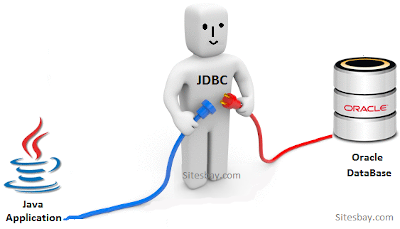
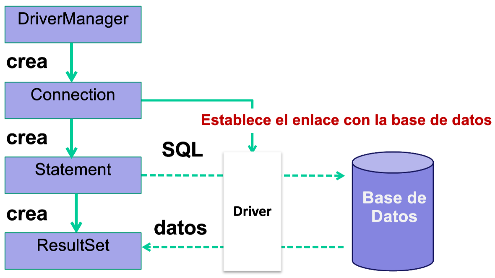

# 1. Introducción


En esta unidad veremos el acceso a los datos de una base de datos relacional desde programas Java.

Para ello se necesitan ***conectores***: _software que se necesita para realizar las conexiones desde nuestro programa Java a la base de datos relacional._




## 1.1 El desfase objeto relacional

* Las bd relacionales no están preparadas para almacenar objetos.
* Existe un desfase entre las construcciones usadas en las bd relacionales con los proporcionados en programación OO.
* Al guardar objetos en una bd relacional se incrementa la complejidad del código para salvar la diferencia entre objetos y tablas.
* Se llama **desfase objeto-relacional**.


* En esta unidad trabajaremos con los problemas del desfase objeto relacional.
  * **No** podemos almacenar objetos en una tabla de una BD relacional. Almacenaremos cada uno de los atributos de un objeto, **uno a uno**.
  * Al escribir tendremos que **descomponer** un objeto en cada uno de sus datos. Al leer, leeremos varias columnas y de cada fila podremos **crear** un objeto con los datos leídos.
* En la siguiente unidad usaremos **herramientas de mapeo objeto-relacional** que hacen que al programador le parezca que está grabando y leyendo objetos en la BD.


# 2. Bases de datos embebidas


* Se utilizarán si no se almacenan grandes cantidades de información.
* El motor de almacenamiento está inscrustado en la aplicación y es exclusivo para ella.
* La BD se inicia al comenzar la aplicación y termina cuando se cierra la aplicación.
* Casi todas son Open Source


## 2.1 SQLite

* SGBD multiplataforma escrito en C que proporciona un motor de bases de datos muy ligero.
* Las BD las guarda en **ficheros**, lo que hace **fácil trasladar** la BD junto con la aplicación.
* Hay varias aplicaciones disponibles para gestionar bases de datos SQLite. Descargamos SQLite desde:
[https://www.sqlite.org/download.html](https://www.sqlite.org/download.html)
* Para instalar la herramienta gráfica DB Browser For SQLite: 
  * ***sudo apt-get install sqlitebrowser***


> Hoja04_BDRelacionales_01


# 3. Protocolos de acceso a BD


* En tecnologías de BD podemos encontrar dos protocolos de conexión a una BD SQL:
  * **ODBC**: define una API para abrir una conexión con una bd, enviar consultas, actualizaciones y obtener resultados. ODBC es un standard de conexión a bases de datos
  * **JDBC**: define una API que usan los programas JAVA para conectarse a BD relacionales.


## 3.1 Acceso a datos mediante JDBC

* JDBC proporciona una **librería estándar** para acceder a bd relacionales.
* Define una arquitectura estándar para que cada fabricante (MySQL, Oracle, etc.) pueda crear los drivers que permitan a los programas en Java acceder a los datos.
* JDBC tienen una interfaz de conexión distinta según la bd. Se llama **driver, controlador o conector**.
* Así las llamadas a los métodos Java de las clases JDBC se correspondan con la API de la bd.


* JDBC nos da clases e **interfaces** para:
  * Conectarse a una bd relacional
  * Enviar consultas e instrucciones de actualización a la bd
  * Recuperar y procesar los resultados recibidos de la bd en respuestas a las consultas.
  * Otras operaciones


* En el paquete **java.sql** se incluyen todas las clases e interfaces de JDBC que puedes usar. [Documentación oficial](https://docs.oracle.com/javase/8/docs/api/java/sql/package-summary.html)

* En el paquete **javax.sql** se incluyen clases e interfaces extensiones de JDBC (para cumplir con el estándar JDBC2). No las vamos a necesitar en nuestros programas. 


## 3.2 Arquitecturas JDBC

* Modelo de **dos capas**: la aplicación Java "habla" directamente con la bd. ​


* Requiere un driver residiendo en el mismo lugar que la aplicación (en el cliente).​


* Modelo de **tres capas**: hay una capa intermedia que recoge la instrucción sql y los resultados de la sentencia.​
​


* El driver de la bd está en el servidor, no en el cliente​.


## 3.3 Funcionamiento de un programa que usa JDBC​





* Procesos realizados por un programa con JDBC:​
  * 1.- importar clases necesarias​
  * 2.- registrar driver JDBC​
  * 3.- identificar el origen de datos​
  * 4.- crear un objeto Connection​
  * 5.- crear un objeto Statement​
  * 6.- ejecutar una consulta con el objeto Statement​
  * 7.- recuperar los datos del objeto ResultSet​
  * 8, 9 y 10: liberar ResultSet, Statement y Connection.​


**Ejemplo de programa que trabaja con una base de datos SQLite**

* Usaremos la base de datos SQLite concursomusica.db creada anteriormente. Tiene las tablas grupos y canciones.​
* Iniciamos un proyecto.​
* Añadimos el driver al fichero pom.xml

```xml
    <dependencies>
        <!-- https://mvnrepository.com/artifact/org.xerial/sqlite-jdbc -->
        <dependency>
            <groupId>org.xerial</groupId>
            <artifactId>sqlite-jdbc</artifactId>
            <version>3.36.0.3</version>
        </dependency>
    </dependencies>
```


* Comenzaremos a desarrollar el programa **registrando el driver de conexión**. 

```java
        try
        {
            Class.forName("org.sqlite.JDBC");
        }
        catch (ClassNotFoundException ex)
        {
            System.err.println("Error al cargar el driver");
        }
```


* Una vez registrado el driver, debemos **especificar el origen de datos** (cuál es la base de datos). 
* El origen de datos se especifica con un String de URL que tiene un formato para para cada SGBD. Para SQLite es:​
* **"jdbc:sqlite:archivo_base_datos"​**


* Con esa URL de origen de datos obtenemos un objeto de conexión con la base de datos (**Connection**) que es indispensable para poder trabajar con ella.​

```java
            conexion = DriverManager.getConnection("jdbc:sqlite:concursomusica.db");
            System.out.println("Conexion OK con concursomusica.db"); 
```


* Una vez que tenemos el objeto conexion creamos un método **consultarGrupos** al que le pasamos el objeto y envía una consulta a SQLite para obtener el nombre y localidad de cada grupo.​


```java
private static void consultarGrupos(Connection conexion)
{
  try
  {
    //Creamos un objeto Statement para enviar instrucciones SQL sin parámetros
    Statement st = conexion.createStatement();
    //Crear instrucción SQL
    String txtSQL = "SELECT nombregrupo, localidad FROM grupos";
    //Devuelve un conjunto de resultados
    ResultSet result = st.executeQuery(txtSQL);
    //Procesar ResultSet...
  }
  catch (SQLException e)
  {
    System.err.println("Error en el método consultarGrupos");
  }
}
```


* Ahora, en el método consultarGrupos, una vez que tenemos en un ResultSet el resultado de la consulta, recorremos cada fila del resultado, extraemos el valor de cada columna y los pintamos en pantalla.​

```java
//Recorrer todas las filas de result, desde la primera
while (result.next())
{
  // Saca el valor de la columna nombregrupo y de la segunda columna
  String nombre = result.getString("nombregrupo");
  String localidad = result.getString(2);
  System.out.println("NOMBRE: " + nombre + ",  LOCALIDAD: " + localidad);
}
```

* Cerramos los objetos ResultSet y Statement.​

```java
st.close();
result.close();
```


* A continuación, vamos a llamar a un método **insertarGrupo** que recoge por teclado los datos de un grupo (excepto el número) e inserta una fila con los datos recogidos para el grupo:


```java
private static void insertarGrupo(Connection conexion)
{
  //Recoger datos (lo ideal sería haber recibido un objeto Grupo por parámetro)
  Scanner teclado = new Scanner(System.in);
  //Crear texto de consulta con parámetros sustituibles
  System.out.println("Nombre");
  String nombre = teclado.nextLine();
  System.out.println("Localidad");
  String localidad = teclado.nextLine();
  System.out.println("¿Es grupo? 0/1");
  int esGrupo = teclado.nextInt();
  teclado.nextLine();
  System.out.println("Fecha");
  String fecha = teclado.nextLine();
  System.out.println("Año");
  int año = teclado.nextInt();

  //Crear texto de consulta con parámetros sustituibles
  String sql = "INSERT INTO grupos (nombregrupo,localidad,"
    + "esgrupo,fechaPrimerConcierto,annoPrimerDisco) "
    + "VALUES (?,?,?,?,?);";
    
  //Construir un PreparedStatement para sustituir valores en consulta parametrizada
  try ( PreparedStatement consultaPreparada = conexion.prepareStatement(sql))
  {
    // Sustituye la ? primera por el contenido de nombre
    consultaPreparada.setString(1, nombre);
    // Sustituye la ? segunda por el contenido de localidad
    consultaPreparada.setString(2, localidad);
    consultaPreparada.setInt(3, esGrupo);
    consultaPreparada.setString(4, fecha);
    consultaPreparada.setInt(5, año);
            
    int numeroGruposInsertados = consultaPreparada.executeUpdate();
    System.out.println("Se han insertado " + numeroGruposInsertados + " grupos");
  }
  catch (SQLException ex)
  {
    System.err.println("Error al insertar un grupo");
  }
}
```


> Hoja04_BDRelacionales_02


# 4. Conexiones a bases de datos en Java


* Ya hemos visto que para poder conectarnos a una base de datos es necesario disponer de la librería para el driver JDBC correspondiente al SGBD. Tendremos que haberlo descargado previamente.
* Para programar el establecimiento de la conexión:
  * Registrar el driver.
  * Establecer el origen de datos
  * Crear un objeto Connection para establecer y manejar la conexión.


## 4.1 El origen de datos

* El origen de los datos indica donde se encuentra la base de datos a la que vamos a conectarnos.
* Un origen de datos se especifica mediante una URL que tiene el siguiente formato: **jdbc:SGBD:accesoBD**


* Donde **SGBD** especifica el SGBD y puede tener, entre otros, los siguientes valores:
  * mariadb
  * mysql
  * postgresql
  * oracle:thin
  * sqlserver
  * sqlite
  * firebirdsql


* **accesoBD** representa los parámetros necesarios para acceder a la BD en el SGBD. Estos parámetros se especifican de distinta forma para cada SGBD. 
* En negrita los valores sustituibles:
  * MySQL
    * //**host:puerto/database**?user=**usuario**&password=**clave**
  * Oracle
    * **usuario**/**password**@**host:puerto:instanciaBD**
  * PostgreSQL
    * //**host:puerto/database**?user=**usuario**&password=**clave**
  * SQLite ( **ruta_database** )


## 4.2 Ejemplos de conexiones

* SQLITE

```java
Class.forName("org.sqlite.JDBC");
Connection conexion= DriverManager.getconnection("jdbc:sqlite:/home/ivan/baseDatos.db");
```

* MySQL

```java
Class.forName("com.mysql.jdbc.Driver");
Connection conexion= DriverManager.getConnection(
  "jdbc:mysql://192.168.0.1/baseDatos?useSSL=false&useUnicode=true&serverTimezone=UTC", 
  "root", "Pwd1234a");
```


* PostgreSQL

```java
Class.forName("org.postgresql.Driver");
Connection conexion= DriverManager.getConnection("jdbc:postgresql://192.168.0.1/baseDatos", 
  "root", "Pwd1234a");
```

* Oracle

```java
Class.forName("oracle.jdbc.driver.OracleDriver");
Connection  conexion = DriverManager.getConnection("jdbc:oracle:thin:@127.0.0.1:1521:baseDatos", 
  "root", "Pwd1234a"); 
```


# 5. Clases para manipular las bases de datos


* Los objetos **gestores de instrucciones** SQL permiten ejecutar instrucciones SQL. 
* Se construyen a partir de un objeto de la clase **Connection**.
* Hay dos clases gestoras de instrucciones:
  * **Statement**: gestiona instrucciones totalmente construidas. Al usarlo para ejecutar una instrucción se le pasa el texto.
  * **PreparedStatement**: gestiona instrucciones parametrizadas. Al construir el objeto, se pasa la instrucción con parámetros sustituibles. Después se asignan valores a los parámetros y al final se usa el objeto para ejecutar.


* **Statement**
  
```java
Statement st=conexion.createStatement();
```

* **PreparedStatement**

```java
String texto="instrucción_SQL_con_parametros";
PreparedStatement prepSt=conexion.prepareStatement(texto);
```


**Métodos de Statement para ejecutar sentencias SQL**

* **int executeUpdate(String)**: envía una sentencia SQL de actualización. Devuelve el nº de filas afectadas.
* **ResultSet executeQuery(String)**: envía una sentencia SQL de consulta que devuelve un conjunto de resultados. 
* **boolean execute(String)**: envía cualquier sentencia SQL. Devuelve si el resultado podría procesarse con un ResultSet o no.
* **ResultSet getResultSet()**: devuelve un Resultset con el último conjunto de resultados obtenido tras ejecutar el métodos execute.


**Ejemplos de uso de Statement**


```java
Statement st=conexion.createStatement();
//ejecutar UPDATE y comprobar cuantas filas se modificaron
String textSQL="UPDATE votos SET fecha=null";
int n=st.executeUpdate(textSQL);
System.out.println("se han actualizado "+n+" filas");
//insertar un usuario
st.executeUpdate("INSERT INTO usuarios (nombre,edad) VALUES ('Alberto',20)");
//insertar un usuario cuyos datos se dan por teclado
String nombre=tec.nextLine();
String edad=tec.nextInt();
st.executeUpdate("INSERT INTO usuarios (nombre,edad) VALUES ('"+
       nombre+"',"+edad+")");
//Obtener el resultado de una consulta
ResultSet result=st.executeQuery("SELECT * FROM usuarios");
```


**Explicación y uso de PreparedStatement**


* **PreparedStatement** permite ejecutar instrucciones parametrizadas.
* Debemos tener una instrucción SQL en la que alguna de sus partes contiene parámetros sustituibles o marcadores, simbolizados en la instrucción con ?.
* Una vez construido el objeto PreparedStatement, se asignan valores a cada uno de los parámetros o marcadores  (numerados de 1 en adelante).
* Asignados los parámetros, ya se puede ejecutar la instrucción. 


* Un objeto PreparedStatement para ejecutar instrucciones SQL debe construirse con el método **prepareStatement** de la clase Connection.
* Al método prepareStatement hay que pasarle un String que contiene el texto de la sentencia o instrucción SQL preparada.
Así, suponiendo que se tiene un objeto con de la clase Connection con una conexión establecida:

```java
//Construye texto de instrucción SQL parametrizada
String textSQL="INSERT INTO personas (nombre,localidad) VALUES (?,?)";
//prepara la instrucción pero no la envía para su ejecución
PreparedStatement prepSt=conexion.prepareStatement(textSQL);
```


* Para asignar valores a los parámetros, se usan los métodos:
  * **setInt(int índice, int valor), setString(int índice, String valor), setDouble(int índice, double valor), setBoolean(int índice, boolean valor), etc.**
* Por ejemplo:

```java
prepSt.setString(2, "Pepe");
prepSt.setFloat(1, 5.0/100);
```


**Ejemplo de uso de PreparedStatement**

```java
//Construye texto de instrucción SQL parametrizada
String textSQL="INSERT INTO personas (nombre,edad) VALUES (?,?)";

//prepara la instrucción pero no la envía para su ejecución
PreparedStatement prepSt=conexion.prepareStatement(textSQL);

//Asigna valores a los dos parámetros
prepSt.setString(1, "Paco");
prepSt.setInt(2, 20);

//Ejecutar la instrucción
prepSt.executeUpdate();
```


**Métodos de PreparedStatement**


* **int  executeUpdate()**: permite enviar la sentencia SQL de actualización cargada en el objeto. Devuelve el número de filas afectadas.
* **ResultSet  executeQuery()**: permite enviar una sentencia SQL de consulta cargada en el objeto. Devuelve un conjunto de resultados. 
* **boolean  execute()**: permite enviar cualquier sentencia SQL cargada en el objeto. Devuelve si el resultado podría procesarse con un ResultSet o no.


> Hoja04_BDRelacionales_03


# 6. Gestión de resultados de una consulta


* Una hoja de resultados es un objeto de tipo ResultSet donde quedan almacenados los resultados de una consulta (select, desc, show).

```java
//Ejemplo de carga de un ResultSet
Statement sentencia=conexion.createStatement();
ResultSet resultados = sentencia.executeQuery("SELECT id,nombre FROM grupos WHERE esgrupo=true");
```

* El contenido de resultados **estará en memoria**, no se muestra en pantalla. Actualmente, no está seleccionada ninguna fila para que se pueda mostrar su contenido.


* Para avanzar fila a fila por el contenido de una hoja de resultados debemos usar el método **next()**. 
* La primera vez que ejecutamos quedará seleccionada la primera fila. Si no hubiera habido ninguna fila devuelta, el método next() hubiera devuelto false.

```java
resultados.next();
```


 * Ahora podemos acceder al contenido de la fila actualmente seleccionada en el ResultSet con los métodos getXXX (**getInt, getString, getFloat, ...**)

```java
int id=resultados.getInt("id"); // o int id=resultados.getInt(1);
String nombre=resultados.getString("nombre"); // o String nombre=resultados.getString(2);
```

* Al ejecutar de nuevo el método **next()** quedará seleccionada la **siguiente fila** la que esté seleccionada actualmente


* Para poder leer todas las filas de un ResultSet haríamos:

```java
resultados =sentencia.executeQuery("SELECT id,nombre FROM grupos WHERE esgrupo=true");
while(resultados.next())
{
	//procesar contenido de fila seleccionada
}
resultados.close();
```


> Hoja04_BDRelacionales_04


## 6.2 Actualización de datos mediante un ResultSet

* Podemos usar una hoja de resultados para **realizar inserciones, modificaciones y eliminaciones** de filas de la tabla consultada en la hoja de resultados. La nueva situación se reflejará en el ResultSet.


* Para poder realizar actualizaciones y usar todos los métodos de movimiento del cursor sobre el ResultSet, se necesita **construir el gestor de sentencias pasando dos constantes** declaradas a tal efecto al método createStatement o al método prepareStatement, si fuera el caso.

```java
Statement sentencia = conexion.createStatement(
           ResultSet.TYPE_SCROLL_SENSITIVE, ResultSet.CONCUR_UPDATABLE);

ResultSet rs= sentencia.executeQuery("SELECT ....................... ");
```


**INSERTAR FILAS**

* Para poder **realizar inserciones de filas** hay que situar el cursor al punto de inserción (después de qué fila consultada queremos realizar la inserción). Hay que usar el método **moveToInsertRow**.

```java
ResultSet rs=st.executeQuery("SELECT nombre, estilo, localidad, esgrupo FROM grupos");
rs.moveToInsertRow();
```


* A continuación hay que dar los valores nuevos valores a las columnas mediante los métodos **updateXXX**.

```java
rs.updateString("nombre", "Ana Boza");
rs.updateString("estilo", "Pop-Glam-Rock");
rs.updateString("localidad", "Madrid");
rs.updateBoolean("esgrupo", false);
```


* Cargados los nuevos valores, hay que usar el método para insertar la fila.

```java
rs.insertRow();
```

* El cursor queda sobre la nueva fila. Para devolver el cursor a la situación previa a la inserción, habría que usar el método **absolute** si conociéramos el número de fila de hoja de resultados antes de haber usado el método **moveToInsertRow**
* También podríamos mover el cursor al inicio de la hoja de resultados con el método **beforeFirst**


**MODIFICAR FILAS**

* Situados sobre una fila de la hoja de resultados, podemos dar nuevos valores a las columnas con los métodos updateXXX.
* Una vez que hemos modificado las columnas, podemos grabar la actualización con el método **updateRow**. El cursor seguirá sobre la fila que se ha modificado. En la consulta sql hay que incluir siempre la **PRIMARY KEY**.


```java
rs=sentencia.executeQuery("select * from componentes");
:::::::::::::::::::::::::::::
rs.next();
// condicionar cuando se hacen modificaciones

//cargar datos nuevos (sólo los que se quieren modificar)
rs.updateString("columna", nuevoTexto);

//modificar la fila con los datos cargados
rs.updateRow();
```


**ELIMINAR FILAS**

* Situados sobre una fila de la hoja de resultados, podemos eliminar dicha fila de la tabla con el método **deleteRow**. El cursor se situará sobre la fila siguiente a la fila eliminada. En la consulta SQL hay que incluir siempre la **PRIMARY KEY**.
  
```java
ResultSet resultados=st.executeQuery("select * from canciones INNER JOIN grupos ON grupo=grupos.id");
while (resultados.next()) {
	int id=resultados.getInt("id");
	String titulo=resultados.getString("titulo");
	String nombre=resultados.getString("nombre");
	System.out.println(id + " titulo : " + titulo + " grupo : " +nombre );
	System.out.println("BORRAR (pulsa S) MANTENER (otra tecla)");
	String letra=teclado.readLine();
	if(letra.toUpperCase().equalsIgnoreCase("S")) {
		resultados.deleteRow(); 	
	} 
```


> Hoja04_BDRelacionales_05


## 6.3 Obtener metadatos de la base de datos

* Mediante la clase **DatabaseMetaData** podemos obtener metadatos de la base de datos. Los metadatos son datos sobre la conexión establecida con la bases de datos, sobre la estructura de la base de datos (tablas que tiene) y sobre cada tabla de la base de datos (nombres de columnas, tipos).


* **Ejemplo**: Suponiendo que tenemos una conexión establecida mediante un objeto **connnection** con la base de datos **tour**, obtener el nombre del SGBD, el nombre del driver, la URL de conexión y el usuario de la sesión cliente.

```java
// construcción del objeto con los metadatos de la conexión
DatabaseMetaData dbmd=connection.getMetaData();
//Obtención de datos de la conexión
System.out.println("INFORMACIÓN SOBRE LA CONEXIÓN");
System.out.println("SGBD : "+dbmd.getDatabaseProductName());
System.out.println("Driver : "+dbmd.getDriverName());
System.out.println("URL : "+dbmd.getURL());
System.out.println("User : "+dbmd.getUserName());
```


* **Ejemplo**: Suponiendo que tenemos un objeto dbmd de la clase DatabaseMetaData, obtener datos sobre cada una de las **tablas y vistas** de la base de datos usada en la conexión.

```java
//Cargar en un ResultSet información sobre cada tabla o vista de la BD
String[] tipos=new String[2];
tipos[0]="TABLE";
tipos[1]="VIEW";
ResultSet result=dbmd.getTables(null, null, "%", tipos);
//Recorrer cada element del Resultset (una table o una view)
while (result.next()){
    // Obtener el nombre del element y el tipo
    String tabla = result.getString("TABLE_NAME");
    String tipo = result.getString("TABLE_TYPE");
    System.out.println(tipo+":"+tabla);
}
```


* **Ejemplo**: Suponiendo que tenemos un objeto dbmd de la clase DatabaseMetaData y un String tabla con el nombre de una tabla de esa base de datos, obtener el **nombre de cada columna** de la tabla, el **tipo** de la columna y si la columna **admite nulos**.

```java
//Cargar en un Resultset metadatos de columnas de una tabla
ResultSet columnas=dbmd.getColumns(null, null, tabla, null);
//Recorrer el resultset (accediendo a cada fila del Resulset)
while (columnas.next()){
 // Obtener datos de la fila actual, es decir, de la columna leída
    String nomColum = columnas.getString("COLUMN_NAME");
    String tipoColum = columnas.getString("TYPE_NAME");
    String tamColum = columnas.getString("COLUMN_SIZE");
    String nula = columnas.getString("IS_NULLABLE");
    System.out.println("\tColumna:"+nomColum+"  tipo="+tipoColum+
            "  tamaño="+tamColum+"  Admite Nulos="+nula);
}
```


* También se pueden obtener metadatos de los resultados de una consulta mediante un objeto de la clase  **ResultSetMetaData**.

```java
Statement st=connection.createStatement();
ResultSet r=st.executeQuery("SELECT * FROM ciclistas");
ResultSetMetaData rmd=r.getMetaData();
```


* Ahora, con el objeto rmd podemos, entre otras cosas, obtener el nombre de cada columna de la consulta y su índice o posición.

```java
// obtener número de columnas que hay en el ResultSet
int numColumnas=rmd.getColumnCount();
// Para cada columna desde la 1 hasta el número de columnas
for(int i=1;i<=numColumnas;i++){
	String nomColumna=rmd.getColumnName(i);
	System.out.println(i+"-"+nomColumna);
}
```


> Hoja04_BDRelacionales_06


# 7. Ejecución de scripts


* Un **script SQL** es un conjunto de instrucciones SQL que se tratan de ejecutar en un mismo proceso (con una misma solicitud de ejecución).
* Para establecer que en una conexión se puedan ejecutar scripts, es necesario que, en la URL usada para establecer la conexión, añadamos la propiedad **allowMultiQueries** con valor **true**.


* Por ejemplo, para una conexión con MySQL:

```java
Connection con =
 DriverManager.getConnection(jdbc:mysql://localhost?allowMultiQueries=true, "root", "root");
```

* Hecha esa conexión ya se puede trabajar normalmente y se permitirá con un método **execute** ejecutar todas las instrucciones de un script almacenado en un String.


## 7.1 Transacciones

* Cuando un script contiene varias instrucciones de actualización (INSERT, UPDATE, DELETE), normalmente se necesita asegurar que se hagan todas las instrucciones o que no se haga ninguna. **NO PUEDEN QUEDAR EJECUTADAS PARTE DE LAS INSTRUCCIONES**.

* Para controlar esto, sabemos que en SQL se usan las transacciones. En un programa Java, podemos activar el estado transaccional, mediante el método **setAutoCommit(boolean estado)** del objeto **Connection**.
  

```java
con.setAutoCommit(false);
```

* Cuando se llega a la última instrucción de una transacción, confirmamos con:

```java
con.commit();
```

* Y si se produce una excepción en la ejecución del script, anulamos con:

```java
con.rollback();
```


* Ejemplo: tenemos un script que contiene tres instrucciones sql para ejecutarse en una transacción. El fichero script se llama script.sql.

```java
  public static void main(String[] args)
    {
        Path fichero = Paths.get("script.sql");
        ejecutarScript(fichero);
    }
    
    
    public static void ejecutarScript(Path fichero)
    {
        String script = leerScript(fichero);
        Connection conexion = Conexion.getInstance().getConnection();
        try
        {
            conexion.setAutoCommit(false);
            
            //Ejecutar el script
            Statement sentencia = conexion.createStatement();
            sentencia.executeUpdate(script);

            //confirmar la transancción
            conexion.commit();
            System.out.println("Se ha realizado terminado la ejecución del script");
            sentencia.close();
        }
        catch (SQLException ex)
        {
            try
            {
                // Algo ha fallado en la ejecución del script, se anula la transacción
                conexion.rollback();
            }
            catch (SQLException ex1)
            {
                System.err.println("Error al hacer el rollback");
            }
            System.err.println("Error al ejecutar el script " + ex.getMessage());
        }
    }

    private static String leerScript(Path fichero)
    {
        String contenido = "";
        try
        {
            contenido = new String(Files.readAllBytes(fichero));
        }
        catch (IOException ex)
        {
            System.err.println("Error al leer el fichero " + ex.getMessage());
        }
        return contenido;
    }
```

# 8. Ejecución de procedimientos almacenados


* **Los procedimientos almacenados o procedures** constan de un conjunto de sentencias SQL y son llamados a ejecución en lenguaje SQL mediante una instrucción **CALL**. 
* Los procedimientos se crean con una instrucción **CREATE PROCEDURE**.
* Una vez creados o almacenados, se ejecutan con una instrucción CALL seguida del nombre del procedimiento y de una lista de los parámetros que se entregan al procedimiento.
* Hay que recordar que los parámetros pueden ser IN, OUT o INOUT.


* **Ejemplo**: se tiene almacenado en la base de datos preguntastest un procedimiento que recibe el identificador de una pregunta y realiza un reseteo de las preguntas y respuestas. 

```sql
CREATE PROCEDURE preguntastest.resetear_pregunta(IN idPregunta INT)
BEGIN
	UPDATE preguntastest.preguntas SET veces_formulada = 0, veces_acertada= 0 WHERE id=idPregunta;
	UPDATE preguntastest.respuestas SET veces_respondida = 0 WHERE pregunta_id = idPregunta;
END
```

* Para ejecutar el procedimiento en SQL escribiríamos la instrucción: **call resetear_pregunta(220);**


* Para poder ejecutar instrucciones **CALL de llamada a procedimientos en Java**, hay que usar objetos de la clase **CallableStatement**.
* Un objeto **CallableStatement** se instancia con el método **prepareCall** del objeto **Connection**.


* Por ejemplo, para preparar la instrucción Call de llamada al procedimiento resetear_pregunta visto anteriormente, haríamos:

```java
String sql="{call resetear_pregunta(?)}";
CallableStatement sentencia=conexion.prepareCall(sql);
```

* Después pasaríamos valores a los parámetros y ejecutaríamos.

```java
sentencia.setInt(1,220);
sentencia.executeUpdate();
```


> Hoja04_BDRelacionales_07
