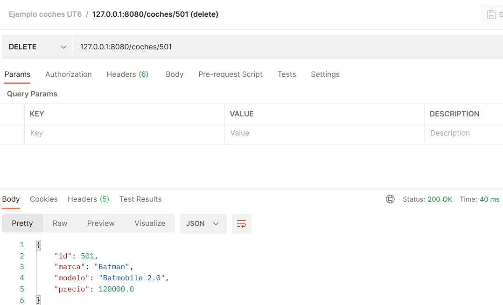
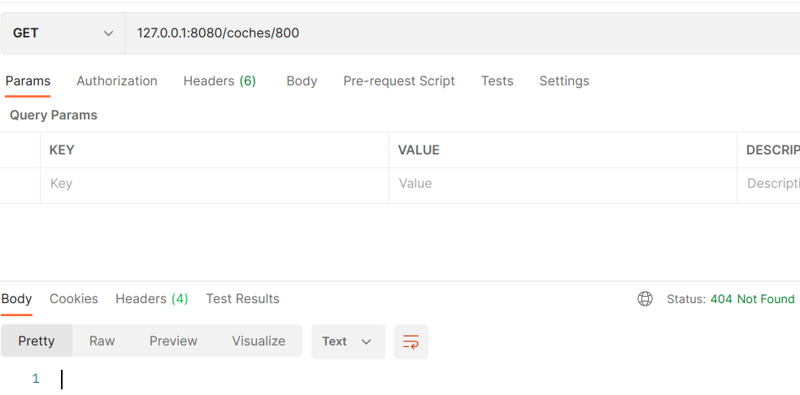
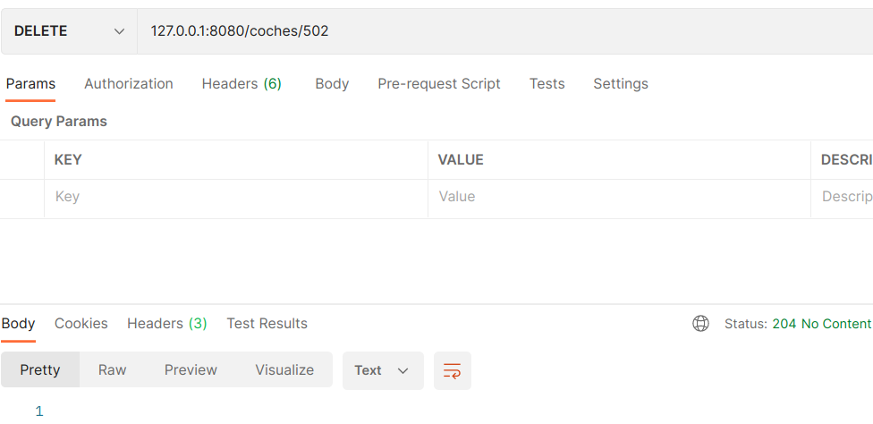

- [1. Introducción](#1-introducción)
- [2. Spring Boot](#2-spring-boot)
- [3. Primer servicio REST](#3-primer-servicio-rest)
- [4. Proyecto completo](#4-proyecto-completo)
	- [4.1 Modelo](#41-modelo)
	- [4.2 Controlador](#42-controlador)
- [5. Mejorando el controlador](#5-mejorando-el-controlador)
	- [5.1 GET](#51-get)
	- [5.2 POST](#52-post)
	- [5.3 PUT](#53-put)
	- [5.4 DELETE](#54-delete)


# 1. Introducción


**¿Qué es REST?**

* REST es una interfaz para conectar varios sistemas basados en el protocolo **HTTP** 
* Nos sirve para obtener y generar datos y operaciones
* Devuelve los datos en formatos específicos, como **XML** y **JSON**.


* El formato más usado en la actualidad es el formato **JSON**
  * Más ligero y legible en comparación a XML. 

* REST se apoya en **HTTP**
* Algunos métodos básicos son:
  * *POST*: para crear recursos nuevos.
  * *GET*: para obtener un recurso en concreto.
  * *PUT*: para modificar un recurso.
  * *DELETE*: para borrar un recurso (un dato por ejemplo de nuestra base de datos)


* En nuestro servicio vamos a almacenar la **lógica de negocio**
* Vamos servir los **datos** con una serie de **recursos URL** 
* La aplicación será el **BACKEND** 
* La mayor **ventaja** es que nos permite **separar el frontend del backend**. 


* Esto quiere decir que nuestra API REST (**backend**) se puede desarrollar con Spring Boot y JPA con acceso al almacenamiento de datos
* Y nuestro **frontend** con:
  * React o Angular por ejemplo (si fuese web)
  * App en Android o aplicación de escritorio con C#, Python o Java


* **Empresas** como como Twitter, Facebook, Google, Netflix, LinkedIn y miles de startups y empresas usan REST
* Estas API pueden ser públicas y lo pueden consumir otros usuarios, con lo cuál tenemos una forma de dar **visibilidad a nuestra API**
* Se pueden consultar miles de APIs en [ProgrammableWeb](https://www.programmableweb.com/category/all/apis)


# 2. Spring Boot


* **Spring** es desde hace años el framework más popular para Java empresarial.
* Pero... ¡es difícil de configurar!
* **Spring Boot** **facilita la creación de aplicaciones** basadas en Spring con mínimo esfuerzo


**Características**

* Fácil gestión de librerías a través del fichero pom.xml (Maven)
* Servidor embebido dentro de la aplicación (dentro del jar)
* Dependencias iniciales que facilitan la configuración
* Sin tener que generar código o configuraciones


**Spring initializr**

* Spring nos ofrece un servicio para la generación rápida del esqueleto de la aplicación
* Se puede hacer desde [https://start.spring.io/](https://start.spring.io/) o desde STS (integrada dentro)


# 3. Primer servicio REST


* El primer proyecto será un ejemplo proporcionado por Spring: [https://spring.io/guides/gs/rest-service/](https://spring.io/guides/gs/rest-service/)
* Crearemos un proyecto en STS desde **File -> New -> Import Spring Getting Started Content**
* Buscamos **"Rest Service"** y elegimos sólo la versión **completa**


* El servicio permite peticiones GET en el puerto 8080 (concretamente en la ruta [http://127.0.0.1:8080/greeting](http://127.0.0.1:8080/greeting))
* Devolverá un JSON

```json
{
  "id": 1,
  "content": "Hello, World!"
}
```


* Si se proporciona el parámetro opcional name ([http://127.0.0.1:8080/greeting?name=Ivan](http://127.0.0.1:8080/greeting?name=Ivan)) devolverá:

```json
{
  "id": 2,
  "content": "Hello, Ivan!"
}
```


* Antes de nada, modificaremos la JRE del proyecto
* Luego examinaremos la clase modelo **Greeting**

```java
public class Greeting {

	private final long id;
	private final String content;

	public Greeting(long id, String content) {
		this.id = id;
		this.content = content;
	}

	public long getId() {
		return id;
	}

	public String getContent() {
		return content;
	}
}
```


* Por otro lado tendremos un controlador **GreetingController**

```java
@RestController
public class GreetingController {

	private static final String template = "Hello, %s!";
	private final AtomicLong counter = new AtomicLong();

	@GetMapping("/greeting")
	public Greeting greeting(@RequestParam(value = "name", defaultValue = "World") String name) {
		return new Greeting(counter.incrementAndGet(), String.format(template, name));
	}
}
```


* Es importante utilizar la anotación **@RestController**


* La anotación **@GetMapping("/greeting")** hace se invoque el método **greeting** al hacer una llamada GET a la dirección http://127.0.0.1/greeting
* El parámetro **name** que recibe el método se anota con **@RequestParam**. Recogerá de la URL el name y lo inyectará al parámetro name del método


* Ejecutaremos la aplicación desde STS, **Run As -> Spring Boot App**
  
* Después, consumiremos la aplicación desde **Postman**


# 4. Proyecto completo


* Vamos a realizar aquí un proyecto algo más completo que el anterior
* Crearemos un proyecto en STS desde **File -> New -> Spring Starter Project**
* Le pondremos un nombre, una descripción y demás datos:


* Añadimos las **dependencias**:
  * MySQL Driver
  * Spring Web
  * Spring Data JPA
  * Spring Boot DevTools
* Y **finalizar**


* Añadiremos lombok al pom.xml

```xml
		<dependency>
			<groupId>org.projectlombok</groupId>
			<artifactId>lombok</artifactId>
			<scope>provided</scope>
		</dependency>
```


* En el fichero **application.properties** (en src/main/resources) estableceremos los valores de nuestra base de datos:

```
spring.datasource.url=jdbc:mysql://localhost:3310/ut6
spring.datasource.username=root
spring.datasource.password=root
spring.datasource.driver-class-name=com.mysql.cj.jdbc.Driver
spring.jpa.database-platform=org.hibernate.dialect.MySQL8Dialect
spring.jpa.hibernate.ddl-auto=none
spring.jpa.show-sql=true
```


## 4.1 Modelo

* Crearemos un paquete llamado modelo y en él la clase **Coche**

```java
@Data @NoArgsConstructor @AllArgsConstructor
@Entity
@Table(name="coches")
public class Coche
{
	@Id
	@GeneratedValue(strategy = GenerationType.IDENTITY)
	private Long id;
	
	private String marca;
	
	private String modelo;
	
	private float precio;
}
```


* En el mismo paquete añadiremos un repositorio
* Será una interface llamada **CocheRepositorio** que herede de **JpaRepository**

```java
public interface CocheRepositorio extends JpaRepository<Coche, Long>
{
	
}
```


## 4.2 Controlador

* Crearemos el paquete controlador y en él la clase **CocheController**
* Será un controlador REST
* Le añadiremos el repositorio que inyectará directamente

```java
@RestController
@RequiredArgsConstructor
public class CocheController
{
	private final CocheRepositorio cocheRepositorio;	
}
```


* Crearemos ahora un método GetMapping para obtener todos los coches

```java
@RestController
@RequiredArgsConstructor
public class CocheController
{
	private final CocheRepositorio cocheRepositorio;
	
	@GetMapping("/coches")
	public List<Coche> obtenerTodos()
	{
		return cocheRepositorio.findAll();
	}
}
```


* Antes de continuar vamos a crear nuestra base de datos y probar el servicio
* Para ello creamos la base de datos ut6 y ejecutamos el script coches.sql
* Después ejecutamos la aplicación **Run As -> Spring Boot App**


* Y probamos con **Postman**


* Crearemos ahora un método para devolver un sólo coche
* El método **findById** devuelve un optional
* De momento vamos a poner que si no lo encuentra devuelva null

```java
	@GetMapping("/coches/{id}")
	public Coche obtenerUno(@PathVariable Long id)
	{
		return cocheRepositorio.findById(id).orElse(null);
	}
```


* El siguiente método será para insertar un nuevo coche
* La petición no será de tipo GET, sino de tipo **POST** ya que estamos enviando datos al servidor
* El método recibirá como parámetro un objeto Coche anotado con **@RequestBody**
* Devolverá el coche creado (con su id autoincremental asignado)

```java
	@PostMapping("/coches")
	public Coche nuevoCoche(@RequestBody Coche nuevo)
	{
		return cocheRepositorio.save(nuevo);
	}
```


* Lo probaremos con Postman. Haremos una petición POST a 127.0.0.1:8080/coches
* En el **Body** elegimos **raw** (de tipo **JSON**) y establecemos los valores de un coche


* Método para **editar** un coche. Será una petición de tipo **PUT**
* De momento comprobaremos que el coche exista y si existe lo guardamos.
* Si no existe devolvemos null

```java
	@PutMapping("/coches/{id}")
	public Coche editarCoche(@RequestBody Coche editar, @PathVariable Long id)
	{
		if(cocheRepositorio.existsById(id))
		{
			editar.setId(id);
			return cocheRepositorio.save(editar);
		}
		else
		{
			return null;
		}
	}
```


* Lo probaremos con Postman. Haremos una petición PUT a 127.0.0.1:8080/coches/501
* En el **Body** elegimos **raw** (de tipo **JSON**) y establecemos los valores que queramos modificar del coche


* Y por último, el método para borrar un coche. 

```java
	@DeleteMapping("/coches/{id}")
	public Coche borrarCoche(@PathVariable Long id)
	{
		if(cocheRepositorio.existsById(id))
		{
			Coche coche = cocheRepositorio.findById(id).get();
			cocheRepositorio.delete(coche);
			return coche;
		}
		else
		{
			return null;
		}
	}
```


* Lo probaremos con Postman. Haremos una petición DELETE a 127.0.0.1:8080/coches/501




# 5. Mejorando el controlador


* Vamos a hacer algunas modificaciones en nuestro servicio
* Usaremos la clase **ResponseEntity<T>** para mejorar la respuesta que enviamos al cliente.
* Nos permitirá indicar un código de respuesta además de enviar el cuerpo. 


* En los métodos **GET** devolveremos un código **200 (OK)** si se localiza el coche. En caso contrario devolveremos un código **404 (Not Found)**
* En el método **POST** devolveremos el código **201 (Created)**
* En el metodo **PUT** devolveremos el código **200 (OK)** si la operación es correcta. En caso contrario el **404**
* En el método **DELETE** devolveremos un código **204 (No Content)**


## 5.1 GET

* Método que devuelve todos los coches

```java
	@GetMapping("/coches")
	public ResponseEntity<?> obtenerTodos()
	{
		List<Coche> coches = cocheRepositorio.findAll();
		if(coches.isEmpty())
			return ResponseEntity.notFound().build();
		
		return ResponseEntity.ok(coches);
	}
```


* Método que devuelve un único coche pasado su id

```java
	@GetMapping("/coches/{id}")
	public ResponseEntity<?> obtenerUno(@PathVariable Long id)
	{
		Coche coche = cocheRepositorio.findById(id).orElse(null);
		if(coche==null)
			return ResponseEntity.notFound().build();
		
		return ResponseEntity.ok(coche);
	}
```


* Podemos probar a obtener un coche con un id inexistente. Ahora nos debería dar el código 404




## 5.2 POST


* El método POST de creación de un coche devuelve el código 201 (created)

```java
	@PostMapping("/coches")
	public ResponseEntity<Coche> nuevoCoche(@RequestBody Coche nuevo)
	{
		Coche guardado = cocheRepositorio.save(nuevo);
		return ResponseEntity.status(HttpStatus.CREATED).body(guardado);
	}
```


* Probamos a guardar un nuevo coche


## 5.3 PUT

* El método PUT de actualización de un coche

```java
	@PutMapping("/coches/{id}")
	public ResponseEntity<?> editarCoche(@RequestBody Coche editar, @PathVariable Long id)
	{
		Coche coche = cocheRepositorio.findById(id).orElse(null);
		if(coche==null)
			return ResponseEntity.notFound().build();
		
		coche.setMarca(editar.getMarca());
		coche.setModelo(editar.getModelo());
		coche.setPrecio(editar.getPrecio());
		
		return ResponseEntity.ok(cocheRepositorio.save(coche));
	}
```


## 5.4 DELETE

* Por último el método DELETE para que devuelva el código 204 (No Content)

```java
	@DeleteMapping("/coches/{id}")
	public ResponseEntity<?> borrarCoche(@PathVariable Long id)
	{
		cocheRepositorio.deleteById(id);
		return ResponseEntity.noContent().build();
	}
```


* Probamos a borrar el coche creado antes


